# 🔧 Text-to-SQL Agent - Technical Architecture

## System Architecture Overview

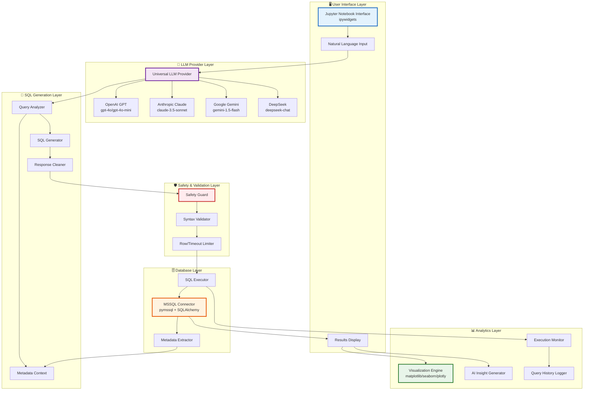

---

## 🔄 Detailed Component Flow

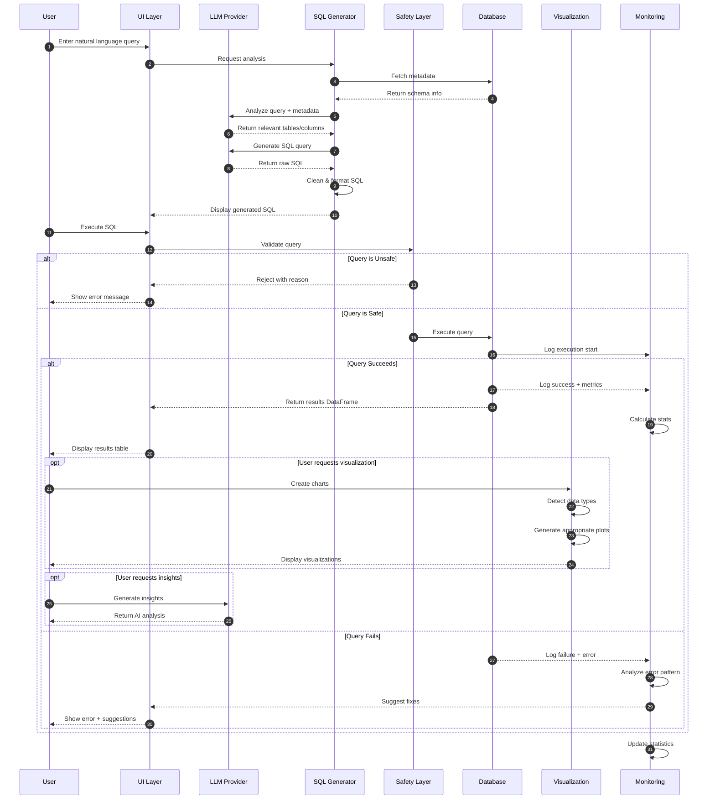

---

## 🏗️ Class Architecture

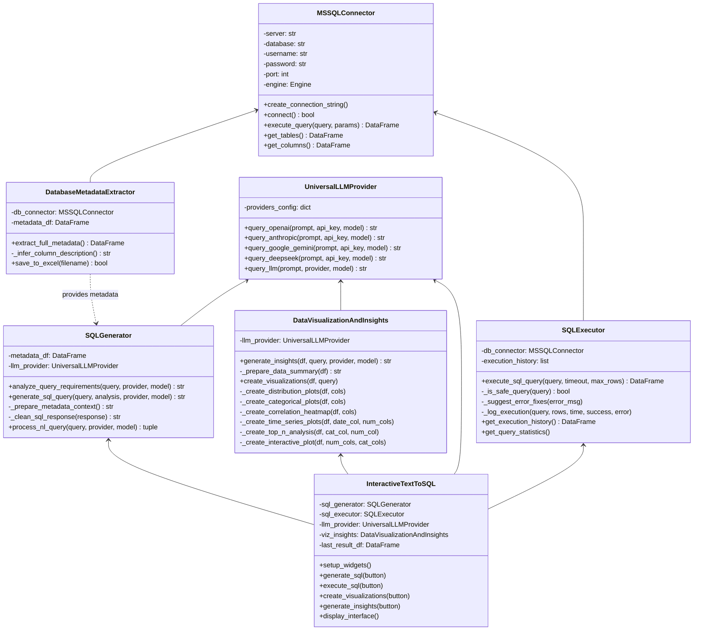

---

## 🛡️ Safety & Guardrails Implementation

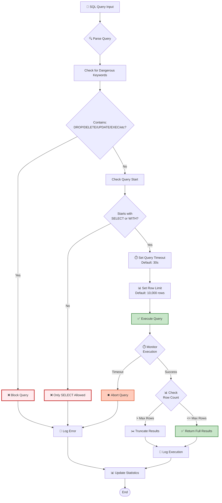

---

## 📊 Monitoring & Logging System

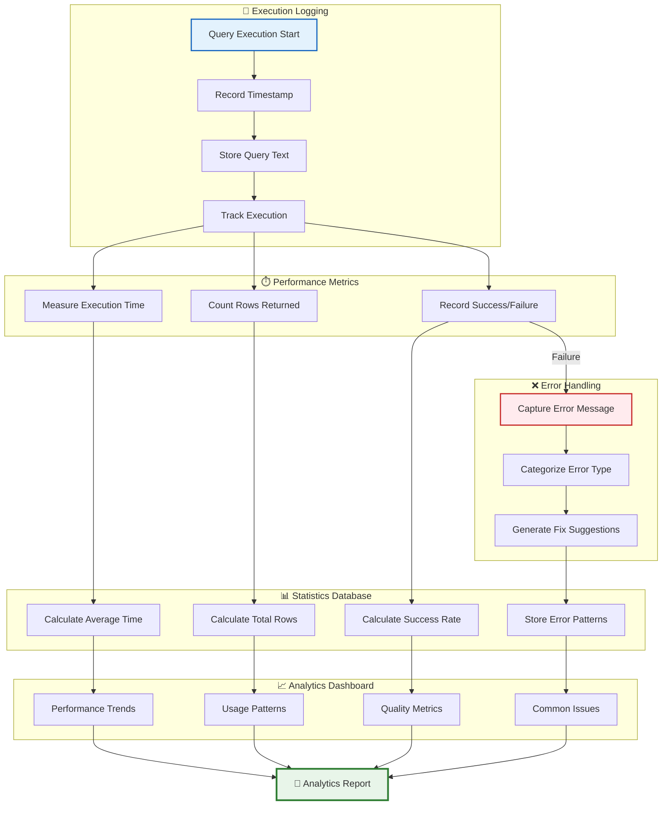

---

## 🎨 Visualization Pipeline

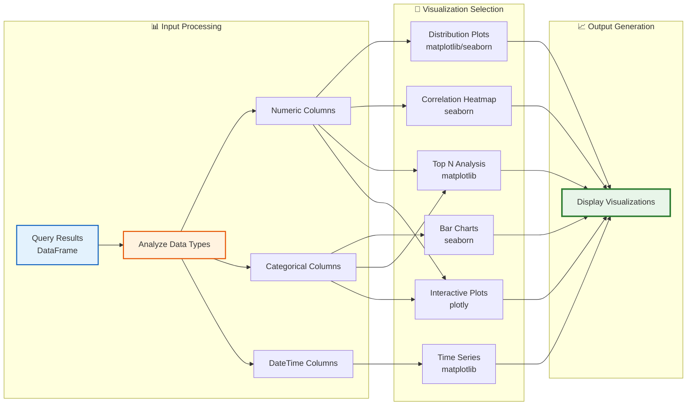

---

## 🔐 Security Architecture

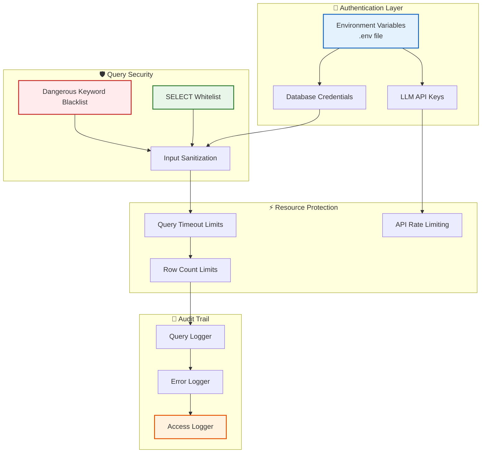

---

## 🔄 Data Flow Architecture

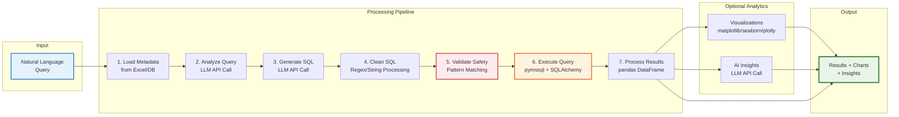

---

## 📦 Technology Stack

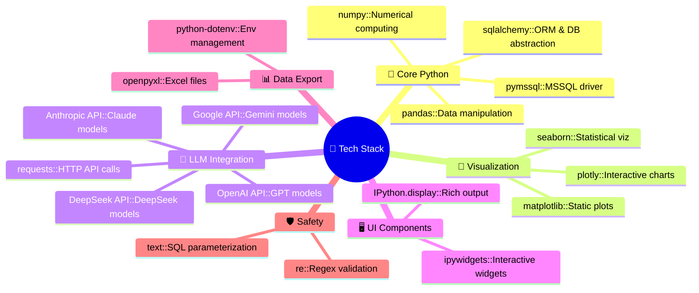

---

## 🔧 Configuration Management

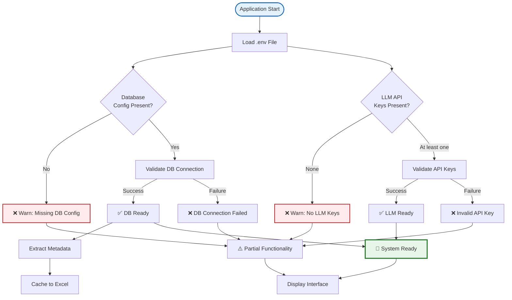

---

## 📈 Performance Optimization Strategies

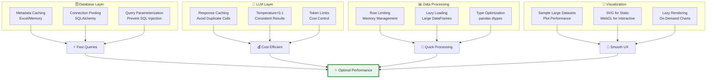

---

## 🧪 Testing & Quality Assurance

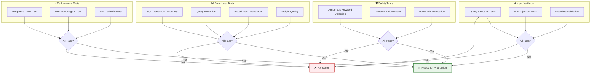

---

## 🚀 Deployment Architecture

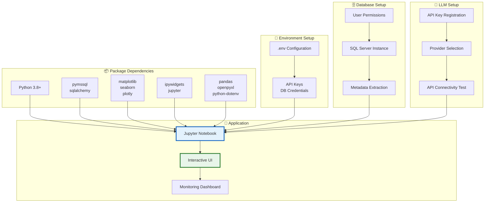

---

## 🔄 Error Recovery Flow

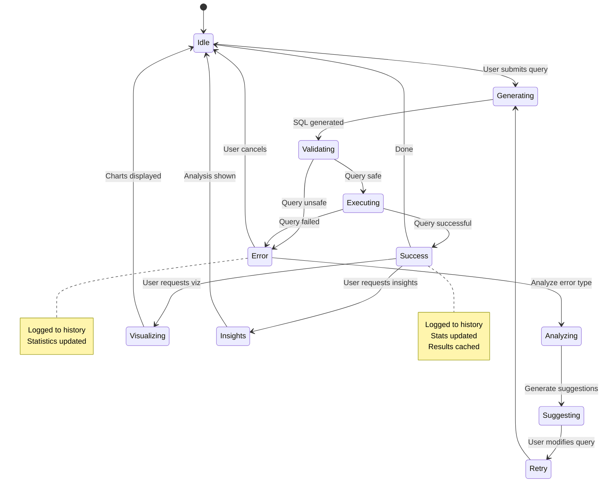

---

## 🏗️ Production-Ready Features Summary

### 🛡️ Safety & Security
- **Query Validation**: Blocks dangerous operations (DROP, DELETE, UPDATE, EXEC)
- **Parameterization**: Prevents SQL injection attacks
- **Timeout Protection**: Prevents long-running queries
- **Row Limits**: Controls memory usage and response size
- **Error Handling**: Graceful degradation with helpful messages

### 📊 Monitoring & Observability
- **Execution Logging**: Complete audit trail of all queries
- **Performance Metrics**: Execution time, row counts, success rates
- **Error Analytics**: Pattern detection and categorization
- **Statistics Dashboard**: Real-time query performance insights
- **History Tracking**: Query history with full context

### 🎨 User Experience
- **Multi-LLM Support**: Flexibility across providers
- **Auto-Visualization**: Intelligent chart selection
- **AI Insights**: Business-friendly analysis
- **Interactive UI**: Easy-to-use widgets
- **Error Guidance**: Helpful fix suggestions

### ⚡ Performance
- **Metadata Caching**: Reduces database calls
- **Connection Pooling**: Efficient resource usage
- **Lazy Loading**: Memory optimization
- **Response Caching**: Reduced LLM API calls
- **Optimized Rendering**: Fast visualization display

### 🔧 Maintainability
- **Modular Design**: Separated concerns, easy to extend
- **Configuration Management**: Environment-based setup
- **Comprehensive Logging**: Debug-friendly output
- **Type Hints**: Better code documentation
- **Clean Architecture**: SOLID principles applied
