# Business Intelligence Agentic Application with Long-Term Memory (LTM)

## 🧠 Overview

This application extends the conversational BI agent with **Long-Term Memory (LTM)** capabilities for intelligent query caching using vector embeddings. It eliminates redundant LLM calls by retrieving SQL from similar past queries, reducing cost and latency while ensuring consistency.


## 🆕 What's New: Long-Term Memory Features

### 1. **Query Caching with Vector Search**
- Every user query is embedded using the same model as metadata (sentence-transformers/all-MiniLM-L12-v2, 384 dimensions)
- Stored in OpenSearch with `knn_vector` field for semantic similarity search
- Finds similar queries even with different wording (e.g., "top 10 customers by revenue" ≈ "show me the 10 highest revenue customers")

### 2. **Smart Query Workflow**
```
User Query → Search LTM (vector search) → Present Top 5 Matches
            ↓
   User Selects Option:
   ├─ Cached Query → Retrieve SQL (no LLM call) → Display
   └─ "Something Else" → Generate New SQL → Store in LTM → Display
```



```mermaid
sequenceDiagram
    participant U as 👤 User
    participant UI as 🖥️ Gradio UI
    participant LTM as 🧠 LTM Manager
    participant OS as 🔍 OpenSearch
    participant RAG as 🔗 RAG Engine
    participant LLM as 🤖 DeepSeek API
    
    rect rgb(230, 245, 255)
        Note over U,LLM: Step 1: Check Similar Queries
        U->>UI: Enter question
        UI->>LTM: Check similar queries
        LTM->>OS: Neural search (k=5, min_score=0.7)
        OS-->>LTM: Top 5 matches + scores
        LTM-->>UI: Format results
        UI-->>U: Display radio options
    end
    
    rect rgb(255, 245, 230)
        Note over U,LLM: Step 2a: User Selects Cached Query
        U->>UI: Select option 1-5
        UI->>LTM: Retrieve cached SQL
        LTM->>OS: Get document by ID
        OS-->>LTM: Return SQL
        LTM-->>UI: SQL + metadata
        UI-->>U: Display SQL ⚡ (instant)
    end
    
    rect rgb(255, 230, 245)
        Note over U,LLM: Step 2b: User Selects "Something Else"
        U->>UI: Select "Something else"
        UI->>RAG: Generate new SQL
        RAG->>OS: Search metadata
        OS-->>RAG: Relevant context
        RAG->>LLM: Prompt with context
        LLM-->>RAG: Generated SQL
        RAG->>LTM: Store in LTM
        LTM->>OS: Index new query-SQL pair
        RAG-->>UI: SQL + explanation
        UI-->>U: Display SQL 🆕
    end
```

### 3. **Cost & Time Optimization**
- **Cached queries**: Instant SQL retrieval (no API call, no latency)
- **New queries**: Standard RAG + LLM generation + auto-storage
- Typical savings: 60-80% reduction in LLM calls for repeated/similar questions

```mermaid
graph TB
    subgraph "Cost & Time Comparison"
        direction LR
        
        subgraph "Without LTM ❌"
            Q1[Query 1] --> LLM1[LLM Call<br/>$0.001]
            Q2[Query 2<br/>similar] --> LLM2[LLM Call<br/>$0.001]
            Q3[Query 3<br/>similar] --> LLM3[LLM Call<br/>$0.001]
            Q4[Query 4<br/>similar] --> LLM4[LLM Call<br/>$0.001]
            Q5[Query 5<br/>similar] --> LLM5[LLM Call<br/>$0.001]
            
            LLM1 --> T1[Total Cost:<br/>$0.005]
            LLM2 --> T1
            LLM3 --> T1
            LLM4 --> T1
            LLM5 --> T1
            
            T1 --> TIME1[Total Time:<br/>15 seconds]
        end
        
        subgraph "With LTM ✅"
            Q6[Query 1] --> LLM6[LLM Call<br/>$0.001]
            Q7[Query 2<br/>similar] --> CACHE1[Cache Hit<br/>$0]
            Q8[Query 3<br/>similar] --> CACHE2[Cache Hit<br/>$0]
            Q9[Query 4<br/>similar] --> CACHE3[Cache Hit<br/>$0]
            Q10[Query 5<br/>similar] --> CACHE4[Cache Hit<br/>$0]
            
            LLM6 --> T2[Total Cost:<br/>$0.001]
            CACHE1 --> T2
            CACHE2 --> T2
            CACHE3 --> T2
            CACHE4 --> T2
            
            T2 --> TIME2[Total Time:<br/>3 seconds]
        end
    end
    
    TIME1 --> SAVE[💰 80% Cost Savings<br/>⚡ 5x Faster]
    TIME2 --> SAVE
    
    style Q1 fill:#ffcdd2,stroke:#c62828,stroke-width:2px,color:#000
    style Q2 fill:#ffcdd2,stroke:#c62828,stroke-width:2px,color:#000
    style Q3 fill:#ffcdd2,stroke:#c62828,stroke-width:2px,color:#000
    style Q4 fill:#ffcdd2,stroke:#c62828,stroke-width:2px,color:#000
    style Q5 fill:#ffcdd2,stroke:#c62828,stroke-width:2px,color:#000
    style LLM1 fill:#ef9a9a,stroke:#d32f2f,stroke-width:2px,color:#000
    style LLM2 fill:#ef9a9a,stroke:#d32f2f,stroke-width:2px,color:#000
    style LLM3 fill:#ef9a9a,stroke:#d32f2f,stroke-width:2px,color:#000
    style LLM4 fill:#ef9a9a,stroke:#d32f2f,stroke-width:2px,color:#000
    style LLM5 fill:#ef9a9a,stroke:#d32f2f,stroke-width:2px,color:#000
    style T1 fill:#fff59d,stroke:#f57f17,stroke-width:2px,color:#000
    style TIME1 fill:#ffab91,stroke:#d84315,stroke-width:2px,color:#000
    
    style Q6 fill:#c8e6c9,stroke:#2e7d32,stroke-width:2px,color:#000
    style Q7 fill:#c8e6c9,stroke:#2e7d32,stroke-width:2px,color:#000
    style Q8 fill:#c8e6c9,stroke:#2e7d32,stroke-width:2px,color:#000
    style Q9 fill:#c8e6c9,stroke:#2e7d32,stroke-width:2px,color:#000
    style Q10 fill:#c8e6c9,stroke:#2e7d32,stroke-width:2px,color:#000
    style LLM6 fill:#a5d6a7,stroke:#388e3c,stroke-width:2px,color:#000
    style CACHE1 fill:#81c784,stroke:#2e7d32,stroke-width:2px,color:#000
    style CACHE2 fill:#81c784,stroke:#2e7d32,stroke-width:2px,color:#000
    style CACHE3 fill:#81c784,stroke:#2e7d32,stroke-width:2px,color:#000
    style CACHE4 fill:#81c784,stroke:#2e7d32,stroke-width:2px,color:#000
    style T2 fill:#fff59d,stroke:#f57f17,stroke-width:2px,color:#000
    style TIME2 fill:#aed581,stroke:#689f38,stroke-width:2px,color:#000
    style SAVE fill:#b39ddb,stroke:#5e35b1,stroke-width:4px,color:#000
```



### 4. **Consistency Guarantee**
- Same question always returns same SQL (no LLM variability)
- Historical queries maintain their original logic
- Audit trail: timestamp + metadata context stored with each query

```mermaid
graph LR
    subgraph "LLM Without Caching - Inconsistent Results"
        A1[👤 Query:<br/>'Top 10 customers<br/>by revenue'] --> B1[🤖 LLM Call]
        B1 --> C1[SQL v1:<br/>ORDER BY total DESC]
        
        A2[👤 Same Query:<br/>'Top 10 customers<br/>by revenue'] --> B2[🤖 LLM Call]
        B2 --> C2[SQL v2:<br/>ORDER BY sum_revenue DESC]
        
        A3[👤 Same Query:<br/>'Top 10 customers<br/>by revenue'] --> B3[🤖 LLM Call]
        B3 --> C3[SQL v3:<br/>ORDER BY revenue_total DESC]
    end
    
    subgraph "LTM with Caching - Consistent Results"
        D1[👤 Query:<br/>'Top 10 customers<br/>by revenue'] --> E1[🤖 LLM Call<br/>First Time]
        E1 --> F1[💾 Store SQL v1]
        F1 --> G1[SQL v1:<br/>ORDER BY total DESC]
        
        D2[👤 Same Query:<br/>'Top 10 customers<br/>by revenue'] --> E2[⚡ Cache Hit]
        E2 --> G2[SQL v1:<br/>ORDER BY total DESC]
        
        D3[👤 Same Query:<br/>'Top 10 customers<br/>by revenue'] --> E3[⚡ Cache Hit]
        E3 --> G3[SQL v1:<br/>ORDER BY total DESC]
    end
    
    C1 -.Different.-> C2
    C2 -.Different.-> C3
    G1 -.Same.-> G2
    G2 -.Same.-> G3
    
    style A1 fill:#ffccbc,stroke:#d84315,stroke-width:2px,color:#000
    style A2 fill:#ffccbc,stroke:#d84315,stroke-width:2px,color:#000
    style A3 fill:#ffccbc,stroke:#d84315,stroke-width:2px,color:#000
    style B1 fill:#ef9a9a,stroke:#c62828,stroke-width:2px,color:#000
    style B2 fill:#ef9a9a,stroke:#c62828,stroke-width:2px,color:#000
    style B3 fill:#ef9a9a,stroke:#c62828,stroke-width:2px,color:#000
    style C1 fill:#fff59d,stroke:#f57f17,stroke-width:2px,color:#000
    style C2 fill:#ffab91,stroke:#e64a19,stroke-width:2px,color:#000
    style C3 fill:#ffcc80,stroke:#ef6c00,stroke-width:2px,color:#000
    
    style D1 fill:#c8e6c9,stroke:#2e7d32,stroke-width:2px,color:#000
    style D2 fill:#c8e6c9,stroke:#2e7d32,stroke-width:2px,color:#000
    style D3 fill:#c8e6c9,stroke:#2e7d32,stroke-width:2px,color:#000
    style E1 fill:#a5d6a7,stroke:#388e3c,stroke-width:2px,color:#000
    style E2 fill:#81c784,stroke:#2e7d32,stroke-width:2px,color:#000
    style E3 fill:#81c784,stroke:#2e7d32,stroke-width:2px,color:#000
    style F1 fill:#b3e5fc,stroke:#0277bd,stroke-width:2px,color:#000
    style G1 fill:#aed581,stroke:#689f38,stroke-width:3px,color:#000
    style G2 fill:#aed581,stroke:#689f38,stroke-width:3px,color:#000
    style G3 fill:#aed581,stroke:#689f38,stroke-width:3px,color:#000
```



## 🔧 Technical Architecture

```mermaid
graph LR
    subgraph "User Interface Layer"
        UI[🖥️ Gradio UI<br/>Tabs 1-7]
    end
    
    subgraph "Application Layer"
        API[🔌 Python App]
        CM[💬 Conversation<br/>Memory]
        LTM_MGR[🧠 LTM Manager]
    end
    
    subgraph "LTM Storage Layer"
        OS[(🔍 OpenSearch<br/>LTM Index)]
        EMB[🎯 Embedding<br/>Pipeline]
        VEC[📊 Vector Space<br/>384-dim]
    end
    
    subgraph "RAG Components"
        META[(📚 Metadata<br/>Index)]
        RAG[🔗 RAG Engine]
    end
    
    subgraph "External Services"
        LLM[🤖 DeepSeek<br/>LLM API]
        PG[(🗄️ PostgreSQL<br/>Northwind DB)]
    end
    
    UI --> API
    API --> CM
    API --> LTM_MGR
    LTM_MGR --> OS
    OS --> EMB
    EMB --> VEC
    API --> RAG
    RAG --> META
    RAG --> LLM
    API --> PG
    
    style UI fill:#e3f2fd,stroke:#1565c0,stroke-width:3px,color:#000
    style API fill:#fff3e0,stroke:#e65100,stroke-width:3px,color:#000
    style CM fill:#f3e5f5,stroke:#6a1b9a,stroke-width:2px,color:#000
    style LTM_MGR fill:#c8e6c9,stroke:#2e7d32,stroke-width:3px,color:#000
    style OS fill:#b3e5fc,stroke:#0277bd,stroke-width:3px,color:#000
    style EMB fill:#ffccbc,stroke:#d84315,stroke-width:2px,color:#000
    style VEC fill:#f0f4c3,stroke:#9e9d24,stroke-width:2px,color:#000
    style META fill:#d1c4e9,stroke:#512da8,stroke-width:2px,color:#000
    style RAG fill:#ffe0b2,stroke:#ef6c00,stroke-width:2px,color:#000
    style LLM fill:#ffcdd2,stroke:#c62828,stroke-width:3px,color:#000
    style PG fill:#b2dfdb,stroke:#00695c,stroke-width:3px,color:#000
```



### LTM Index Structure
```json
{
  "user_query": "Show top 10 customers by revenue",
  "user_query_embedding": [0.123, -0.456, ...],  // 384-dimensional vector
  "generated_sql": "SELECT c.\"CustomerID\", ...",
  "timestamp": "2024-01-15T10:30:00",
  "metadata_context": "Used tables: customers, sales_details"
}
```

### Key Components

1. **LTM Index**: `query_long_term_memory`
   - Mapping: `user_query_embedding` (knn_vector, dimension=384, engine=lucene, space_type=cosinesimil)
   - Auto-embedding via ingest pipeline: `ltm_embedding_pipeline`

2. **Embedding Pipeline**
   - Same model as metadata embedding: `sentence-transformers/all-MiniLM-L12-v2`
   - Consistent vector space for reliable similarity search

3. **Search Strategy**
   - Neural search with k=5 (top 5 matches)
   - Min score threshold: 0.7 (70% similarity)
   - Sorted by relevance score

4. **Storage Strategy**
   - Store after successful SQL generation
   - Include conversation context metadata
   - Timestamped for audit trail

## 🚀 How to Use

### Step-by-Step Workflow

**Tab 6: Ask Questions (Updated UI)**

1. **Enter your question** in the text box
   ```
   Example: "Segment customers based on their order values and frequency"
   ```

2. **Click "🔍 Check Similar Queries"**
   - System searches LTM using vector embeddings
   - Displays top 5 similar past queries with scores
   - Shows option "Something else" for new queries

3. **Select from radio buttons**:
   - **Option 1-5**: Cached query (instant SQL, no LLM call)
   - **"Something else"**: Generate new SQL with LLM

4. **Click "✅ Use Selected Query"**
   - If cached: Retrieves SQL immediately
   - If new: Generates SQL → Stores in LTM → Displays result

5. **Review SQL and conversation history**
   - SQL appears in main output box
   - Conversation history shows in side panel

6. **Execute in Tab 7** as usual

### Example Scenarios

```mermaid
flowchart TD
    subgraph Scenario1["📝 Scenario 1: First Time Query"]
        A1[User asks:<br/>'Show top 10 customers<br/>by total revenue'] --> B1[🔍 Search LTM]
        B1 --> C1[❌ No similar<br/>queries found]
        C1 --> D1[User selects<br/>'Something else']
        D1 --> E1[🤖 Generate SQL<br/>with LLM]
        E1 --> F1[💾 Store in LTM]
        F1 --> G1[📊 Display result]
    end
    
    subgraph Scenario2["🔄 Scenario 2: Similar Query Next Day"]
        A2[User asks:<br/>'Top 10 customers<br/>sorted by revenue'] --> B2[🔍 Search LTM]
        B2 --> C2[✅ Found 5 similar queries]
        C2 --> D2[Present options:<br/>Score 0.92<br/>'Show top 10 customers...']
        D2 --> E2[User selects<br/>option 1]
        E2 --> F2[⚡ Retrieve cached SQL<br/>NO LLM CALL]
        F2 --> G2[📊 Display instantly]
    end
    
    subgraph Scenario3["💬 Scenario 3: Follow-up with Context"]
        A3[User asks:<br/>'Show me top 5<br/>from that result'] --> B3[💭 Conversation memory<br/>provides context]
        B3 --> C3[🔍 Check LTM for<br/>similar follow-ups]
        C3 --> D3[❌ No match for<br/>specific context]
        D3 --> E3[🤖 Generate new SQL<br/>with context]
        E3 --> F3[💾 Store in LTM]
        F3 --> G3[📊 Display result]
    end
    
    Scenario1 --> Scenario2
    Scenario2 --> Scenario3
    
    style A1 fill:#e1f5ff,stroke:#01579b,stroke-width:2px,color:#000
    style B1 fill:#fff9c4,stroke:#f57f17,stroke-width:2px,color:#000
    style C1 fill:#ffcdd2,stroke:#c62828,stroke-width:2px,color:#000
    style D1 fill:#f3e5f5,stroke:#4a148c,stroke-width:2px,color:#000
    style E1 fill:#ffe0b2,stroke:#e65100,stroke-width:2px,color:#000
    style F1 fill:#b3e5fc,stroke:#0277bd,stroke-width:2px,color:#000
    style G1 fill:#c8e6c9,stroke:#2e7d32,stroke-width:2px,color:#000
    
    style A2 fill:#e1f5ff,stroke:#01579b,stroke-width:2px,color:#000
    style B2 fill:#fff9c4,stroke:#f57f17,stroke-width:2px,color:#000
    style C2 fill:#c8e6c9,stroke:#2e7d32,stroke-width:2px,color:#000
    style D2 fill:#dcedc8,stroke:#689f38,stroke-width:2px,color:#000
    style E2 fill:#f3e5f5,stroke:#4a148c,stroke-width:2px,color:#000
    style F2 fill:#81c784,stroke:#2e7d32,stroke-width:3px,color:#000
    style G2 fill:#aed581,stroke:#689f38,stroke-width:3px,color:#000
    
    style A3 fill:#e1f5ff,stroke:#01579b,stroke-width:2px,color:#000
    style B3 fill:#f3e5f5,stroke:#6a1b9a,stroke-width:2px,color:#000
    style C3 fill:#fff9c4,stroke:#f57f17,stroke-width:2px,color:#000
    style D3 fill:#ffcdd2,stroke:#c62828,stroke-width:2px,color:#000
    style E3 fill:#ffe0b2,stroke:#e65100,stroke-width:2px,color:#000
    style F3 fill:#b3e5fc,stroke:#0277bd,stroke-width:2px,color:#000
    style G3 fill:#c8e6c9,stroke:#2e7d32,stroke-width:2px,color:#000
```



**Scenario 1: First Time Query**
```
Query: "Show top 10 customers by total revenue"
→ No similar queries found
→ Select "Something else"
→ System generates SQL using RAG + LLM
→ SQL stored in LTM
→ Display result
```

**Scenario 2: Similar Query (Next Day)**
```
Query: "Top 10 customers sorted by revenue"
→ Found 5 similar queries:
   1. "Show top 10 customers by total revenue" (score: 0.92)
   2. "List 10 best customers by sales" (score: 0.85)
   ...
→ Select option 1
→ Retrieve cached SQL (no LLM call)
→ Display result instantly
```

**Scenario 3: Follow-up Question (with Conversation Memory)**
```
Query: "Show me the top 5 from that result"
→ Conversation memory provides context from previous query
→ Check LTM for similar follow-ups
→ Generate or retrieve SQL
→ Store if new
```

## 📊 Benefits

```mermaid
mindmap
  root((📊 LTM Benefits))
    For Users 👤
      Faster Responses ⚡
        Cached: <1 sec
        No waiting
        Instant results
      Consistent Results 🎯
        Same Q = Same SQL
        No variability
        Predictable output
      Cost Savings 💰
        80% reduction
        No API charges
        Efficient usage
      Better UX 🎨
        Preview similar queries
        Informed choices
        Smart suggestions
    For Developers 💻
      Audit Trail 📝
        All queries logged
        Timestamp tracking
        Metadata context
      Debugging 🐛
        Historical patterns
        Usage analysis
        Error tracking
      Optimization 🚀
        Identify popular queries
        Precompute common ones
        Performance insights
      Scalability 📈
        Reduced LLM load
        Better resource usage
        Cost effective growth
```



### For Users
- **Faster responses**: Cached queries return instantly
- **Consistent results**: Same question = same SQL every time
- **Cost savings**: Reduced API calls to LLM provider
- **Better UX**: Preview similar queries before committing to new generation

### For Developers
- **Audit trail**: All queries logged with timestamps
- **Debugging**: Historical queries help understand usage patterns
- **Optimization**: Identify frequently asked questions for precomputation
- **Scalability**: LTM reduces load on LLM service

## 🔄 Differences from Folder 5 (Conversation Memory Only)

```mermaid
graph TB
    subgraph "Folder 5: Conversation Memory Only"
        U1[👤 User Query] --> CM1[💬 Conversation<br/>Memory]
        CM1 --> RAG1[🔗 RAG Engine]
        RAG1 --> LLM1[🤖 LLM Call<br/>Every Time]
        LLM1 --> SQL1[📝 Generated SQL]
        SQL1 --> EXEC1[▶️ Execute]
        EXEC1 --> FORGET1[❌ Forget<br/>on Session End]
    end
    
    subgraph "Folder 7: Conversation + Long-Term Memory"
        U2[👤 User Query] --> LTM2{🧠 LTM Check}
        LTM2 -->|Cache Hit| CACHED[⚡ Retrieve SQL<br/>No LLM Call]
        LTM2 -->|Cache Miss| CM2[💬 Conversation<br/>Memory]
        CM2 --> RAG2[🔗 RAG Engine]
        RAG2 --> LLM2[🤖 LLM Call<br/>Only for New]
        LLM2 --> STORE[💾 Store in LTM]
        STORE --> SQL2[📝 SQL]
        CACHED --> SQL2
        SQL2 --> EXEC2[▶️ Execute]
        EXEC2 --> PERSIST[✅ Persist<br/>Across Sessions]
    end
    
    subgraph "Key Differences"
        D1[📊 LLM Calls:<br/>Every Query]
        D2[📊 LLM Calls:<br/>New Queries Only]
        
        D3[💰 Cost:<br/>100%]
        D4[💰 Cost:<br/>20-40%]
        
        D5[⏱️ Speed:<br/>~3 sec/query]
        D6[⏱️ Speed:<br/>~0.5 sec cached]
        
        D7[🔄 Persistence:<br/>Session Only]
        D8[🔄 Persistence:<br/>Permanent]
        
        D9[🎯 Consistency:<br/>Variable]
        D10[🎯 Consistency:<br/>Guaranteed]
    end
    
    SQL1 -.->|Folder 5| D1
    SQL1 -.->|Folder 5| D3
    SQL1 -.->|Folder 5| D5
    SQL1 -.->|Folder 5| D7
    SQL1 -.->|Folder 5| D9
    
    SQL2 -.->|Folder 7| D2
    SQL2 -.->|Folder 7| D4
    SQL2 -.->|Folder 7| D6
    SQL2 -.->|Folder 7| D8
    SQL2 -.->|Folder 7| D10
    
    style U1 fill:#ffccbc,stroke:#d84315,stroke-width:2px,color:#000
    style CM1 fill:#f3e5f5,stroke:#6a1b9a,stroke-width:2px,color:#000
    style RAG1 fill:#ffe0b2,stroke:#ef6c00,stroke-width:2px,color:#000
    style LLM1 fill:#ef9a9a,stroke:#c62828,stroke-width:3px,color:#000
    style SQL1 fill:#fff59d,stroke:#f57f17,stroke-width:2px,color:#000
    style EXEC1 fill:#ffab91,stroke:#e64a19,stroke-width:2px,color:#000
    style FORGET1 fill:#cfd8dc,stroke:#455a64,stroke-width:2px,color:#000
    
    style U2 fill:#c8e6c9,stroke:#2e7d32,stroke-width:2px,color:#000
    style LTM2 fill:#b3e5fc,stroke:#0277bd,stroke-width:3px,color:#000
    style CACHED fill:#81c784,stroke:#2e7d32,stroke-width:3px,color:#000
    style CM2 fill:#f3e5f5,stroke:#6a1b9a,stroke-width:2px,color:#000
    style RAG2 fill:#ffe0b2,stroke:#ef6c00,stroke-width:2px,color:#000
    style LLM2 fill:#a5d6a7,stroke:#388e3c,stroke-width:2px,color:#000
    style STORE fill:#b2dfdb,stroke:#00695c,stroke-width:3px,color:#000
    style SQL2 fill:#aed581,stroke:#689f38,stroke-width:2px,color:#000
    style EXEC2 fill:#dcedc8,stroke:#689f38,stroke-width:2px,color:#000
    style PERSIST fill:#b39ddb,stroke:#5e35b1,stroke-width:3px,color:#000
    
    style D1 fill:#ffcdd2,stroke:#c62828,stroke-width:2px,color:#000
    style D2 fill:#c8e6c9,stroke:#2e7d32,stroke-width:2px,color:#000
    style D3 fill:#ffcdd2,stroke:#c62828,stroke-width:2px,color:#000
    style D4 fill:#c8e6c9,stroke:#2e7d32,stroke-width:2px,color:#000
    style D5 fill:#ffcdd2,stroke:#c62828,stroke-width:2px,color:#000
    style D6 fill:#c8e6c9,stroke:#2e7d32,stroke-width:2px,color:#000
    style D7 fill:#ffcdd2,stroke:#c62828,stroke-width:2px,color:#000
    style D8 fill:#c8e6c9,stroke:#2e7d32,stroke-width:2px,color:#000
    style D9 fill:#ffcdd2,stroke:#c62828,stroke-width:2px,color:#000
    style D10 fill:#c8e6c9,stroke:#2e7d32,stroke-width:2px,color:#000
```



| Feature | Folder 5 | Folder 7 (This App) |
|---------|----------|---------------------|
| **Conversation Memory** | ✅ Yes | ✅ Yes |
| **Long-Term Memory** | ❌ No | ✅ Yes |
| **Query Caching** | ❌ No | ✅ Vector-based |
| **Similar Query Search** | ❌ No | ✅ Top 5 matches |
| **LLM Call Optimization** | Every query | Only for new/unique queries |
| **UI Workflow** | Single "Generate SQL" button | Two-step: Check similar → Select |
| **Storage** | Session-based conversation only | Persistent query cache |
| **Cost Efficiency** | Standard | 60-80% reduction |

## 🛠️ Setup Requirements

### Prerequisites (Same as Folder 5)
- OpenSearch cluster (2.x)
- PostgreSQL database with Northwind data
- DeepSeek API key
- Python 3.8+

### Installation
```bash
cd opensearch/my_tutorial/scripts/5.\ REALTIME_PROJECTS/7.\ business_intelligence_agentic_app_ltm/
pip install -r requirements.txt
```

### Environment Variables (.env)
```env
# OpenSearch
OPENSEARCH_HOST=localhost
OPENSEARCH_PORT=9200
OPENSEARCH_USER=admin
OPENSEARCH_PASSWORD=admin

# PostgreSQL
POSTGRES_HOST=localhost
POSTGRES_PORT=5432
POSTGRES_DB=northwind
POSTGRES_USER=your_user
POSTGRES_PASSWORD=your_password

# DeepSeek API
DEEPSEEK_API_KEY=sk-your-key-here
DEEPSEEK_BASE_URL=https://api.deepseek.com
```

### Run the Application
```bash
python app.py
```

Access at: `http://localhost:7861`

## 🧪 Testing the LTM Feature

### Test Case 1: First Query
```
1. Run setup (Tab 1-5)
2. Go to Tab 6
3. Enter: "Show top 10 products by sales"
4. Click "Check Similar Queries"
5. Expected: No similar queries found → Select "Something else"
6. Click "Use Selected Query"
7. Expected: SQL generated and stored in LTM
```

### Test Case 2: Similar Query
```
1. Enter: "List 10 products sorted by sales"
2. Click "Check Similar Queries"
3. Expected: Previous query appears in top 5 (score > 0.7)
4. Select the cached query
5. Click "Use Selected Query"
6. Expected: SQL retrieved instantly (no LLM call)
```

### Test Case 3: Different Query
```
1. Enter: "Count customers by country"
2. Click "Check Similar Queries"
3. Expected: No matching queries (different intent)
4. Select "Something else"
5. Generate new SQL and store
```

## 📁 File Structure

```
7. business_intelligence_agentic_app_ltm/
├── app.py                    # Main application with LTM features
├── requirements.txt          # Python dependencies
├── .env                      # Environment variables (create this)
└── README.md                 # This file
```

## 🔍 Key Functions (New in Folder 7)

### LTM Management Functions

1. **`create_ltm_index(os_client, model_id)`**
   - Creates LTM index with 384d knn_vector field
   - Sets up ingest pipeline for auto-embedding
   - Returns success status and message

2. **`search_similar_queries_in_ltm(os_client, user_query, model_id, top_k=5)`**
   - Performs neural search using query embedding
   - Returns top K similar queries with scores
   - Filters by min_score=0.7 (70% similarity)

3. **`store_query_in_ltm(os_client, user_query, generated_sql, metadata_context="")`**
   - Stores query-SQL pair in LTM
   - Auto-generates embedding via pipeline
   - Adds timestamp and metadata

4. **`format_similar_queries_for_display(similar_queries)`**
   - Formats search results as numbered options
   - Shows score and query text
   - Adds "Something else" option

### UI Workflow Functions

5. **`check_similar_queries_ui(user_query)`**
   - Step 1: Search LTM and present options
   - Updates radio button choices
   - Shows/hides UI elements dynamically

6. **`handle_query_selection_ui(user_query, selected_option)`**
   - Step 2: Process user selection
   - Routes to cached retrieval or new generation
   - Updates conversation history

7. **`generate_new_sql_ui(user_query)`**
   - Step 3: Generate new SQL if selected
   - Same RAG + LLM logic as folder 5
   - Stores in LTM after generation

## 🎯 Future Enhancements

1. **Query Similarity Tuning**
   - Adjustable min_score threshold
   - User feedback on match quality
   - Learning-based threshold adjustment

2. **LTM Management UI**
   - View all cached queries (Tab 8)
   - Delete obsolete queries
   - Export query history

3. **Query Versioning**
   - Store multiple SQL versions per query
   - Track performance metrics
   - A/B testing different SQL approaches

4. **Analytics Dashboard**
   - LTM hit rate metrics
   - Most popular queries
   - Cost savings estimation

## 📝 Notes

- LTM is **optional**: App works without it (degrades gracefully)
- LTM persists across sessions (unlike conversation memory)
- Embedding model must match metadata embedding for consistent vector space
- Min score 0.7 is configurable in `search_similar_queries_in_ltm()`

## 🐛 Troubleshooting

**Issue**: "LTM index creation failed"
- Check OpenSearch cluster health
- Verify model is registered and deployed
- Check logs for specific error

**Issue**: "No similar queries found" (when expecting matches)
- Lower min_score threshold (try 0.6)
- Check query embedding generation
- Verify LTM pipeline is active

**Issue**: "Cached SQL doesn't match current context"
- This is expected - cached queries use original context
- Select "Something else" to generate fresh SQL
- Consider adding context fingerprinting for better matching

## 📚 References

- **OpenSearch Neural Search**: https://opensearch.org/docs/latest/search-plugins/neural-search/
- **Sentence Transformers**: https://www.sbert.net/docs/pretrained_models.html
- **DeepSeek API**: https://platform.deepseek.com/docs
- **Gradio Documentation**: https://www.gradio.app/docs

## 🤝 Contributing

This is a tutorial/demo application. For production use:
- Add authentication and user isolation
- Implement query access control
- Add monitoring and logging
- Optimize vector search performance
- Consider distributed OpenSearch cluster

