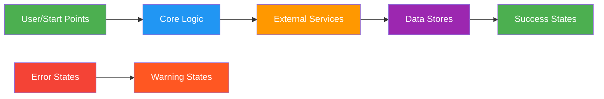
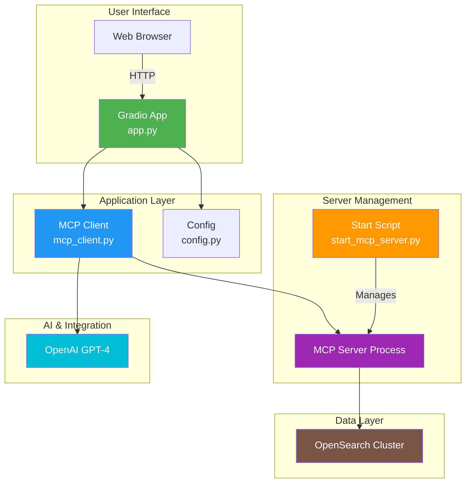
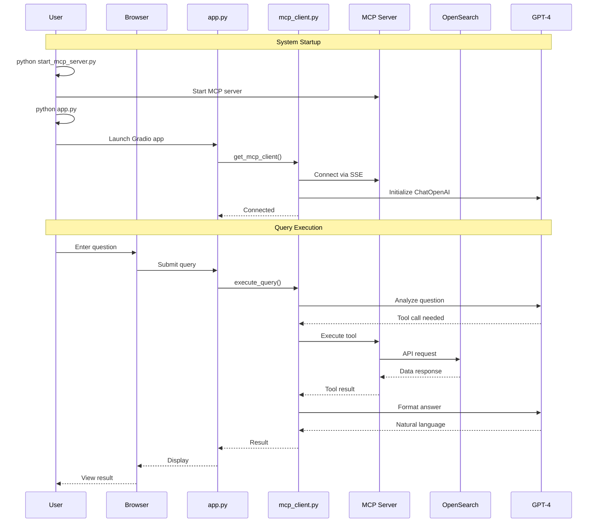
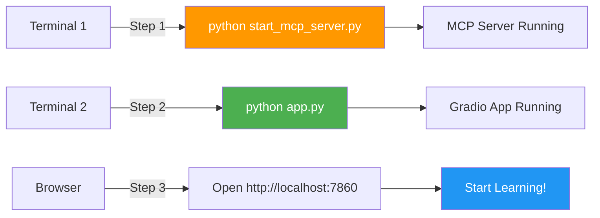

# OpenSearch MCP Server Application - Documentation Index

## 📚 Documentation Overview

This folder contains comprehensive technical documentation for the OpenSearch MCP Server Educational Demo Application. Each document includes detailed explanations, colorful Mermaid diagrams, and flow charts to help understand the system architecture and logic.

## 📑 Available Documentation

### 1. [MCP Client Documentation](./mcp_client_documentation.md) (`mcp_client.py`)

**Purpose**: Core client library for interacting with the MCP server and orchestrating AI-powered OpenSearch operations.

**Topics Covered**:
- 🏗️ Architecture overview and singleton pattern
- 🚀 Initialization flow and connection management
- 🤖 Query execution with agent loop
- 🔧 Tool management and categorization
- 💬 Message flow between components
- 📊 Data structures and class diagrams
- 🔐 Security considerations
- 📈 Performance optimization
- 🐛 Troubleshooting guide

**Key Diagrams**:
- Architecture overview with external services
- Singleton pattern implementation
- Query execution agent loop
- Tool categorization flow
- Message sequence diagrams

**Best For**: Understanding how the AI agent processes queries and communicates with OpenSearch.

---

### 2. [MCP Server Startup Documentation](./start_mcp_server_documentation.md) (`start_mcp_server.py`)

**Purpose**: Helper script for managing the MCP server lifecycle including startup, health checks, and graceful shutdown.

**Topics Covered**:
- 🏗️ Server startup architecture
- 🔄 Detailed execution flow
- 🔍 Port availability checking
- 📦 Subprocess command construction
- 💊 Health check loop mechanism
- 🔄 Process lifecycle states
- 🔐 Environment and configuration
- 🛡️ Error handling strategies
- 🔧 Process management

**Key Diagrams**:
- Complete execution flow
- Port availability check sequence
- Health check loop
- Process lifecycle states
- Environment configuration

**Best For**: Understanding server deployment and process management.

---

### 3. [Gradio Application Documentation](./app_documentation.md) (`app.py`)

**Purpose**: Interactive web application providing an educational interface for learning OpenSearch through natural language.

**Topics Covered**:
- 🏗️ Application architecture
- 🚀 Startup flow and initialization
- 🎨 UI component structure
- 🔄 Query processing flow
- 📑 Tab structure and educational content
- 🎯 Function responsibilities
- 🔗 Component interactions
- 🚦 State management
- 📋 Educational content strategy
- 🧪 Complete user journey

**Key Diagrams**:
- Application architecture layers
- Startup sequence
- UI component hierarchy
- Query processing flow
- Tab content structure
- Event handling
- User journey map

**Best For**: Understanding the user interface and educational design.

---

## 🎨 Diagram Color Coding

Throughout the documentation, we use consistent color coding for clarity:



- 🟢 **Green (#4CAF50)**: Entry points, success states, user interactions
- 🔵 **Blue (#2196F3)**: Core application logic, main components
- 🟠 **Orange (#FF9800)**: External services, MCP server, tools
- 🟣 **Purple (#9C27B0)**: Data stores, OpenSearch, databases
- 🔴 **Red (#F44336)**: Error states, failures
- 🟥 **Deep Orange (#FF5722)**: Warnings, cautions
- 🔷 **Cyan (#00BCD4)**: AI/LLM components, GPT-4

## 🔗 System Architecture Overview



## 📊 Component Interaction Flow



## 🚀 Quick Start Guide

### Prerequisites
1. OpenSearch cluster running
2. Python environment with dependencies installed
3. OpenAI API key configured

### Startup Sequence



## 📖 Reading Guide

### For Developers
1. Start with **MCP Client Documentation** to understand the core logic
2. Read **MCP Server Startup Documentation** for deployment
3. Review **Gradio Application Documentation** for UI implementation

### For DevOps/Infrastructure
1. Start with **MCP Server Startup Documentation** for server management
2. Review **MCP Client Documentation** for integration points
3. Check **Gradio Application Documentation** for deployment config

### For Product/UX Designers
1. Start with **Gradio Application Documentation** for user flows
2. Review educational content strategy
3. Check component interactions and state management

## 🔍 Key Concepts

### Model Context Protocol (MCP)
A protocol that allows AI models to access external tools and data sources in a standardized way.

### Agent Loop
An iterative process where the AI:
1. Analyzes the user's question
2. Decides which tools to use
3. Executes the tools
4. Processes the results
5. Generates a natural language response

### Singleton Pattern
Design pattern ensuring only one instance of the MCP client exists, improving resource efficiency.

### SSE Transport
Server-Sent Events - a protocol for streaming updates from server to client over HTTP.

## 🐛 Common Troubleshooting

| Issue | Documentation Section | Quick Fix |
|-------|----------------------|-----------|
| MCP server won't start | start_mcp_server.md → Error Handling | Check port availability |
| Connection timeout | mcp_client.md → Troubleshooting | Verify MCP server is running |
| Query fails | mcp_client.md → Error Handling | Check OpenSearch connection |
| UI not loading | app.md → Launch Configuration | Check port 7860 availability |
| Tool not found | mcp_client.md → Tool Management | Verify MCP server tools loaded |

## 📚 Additional Resources

### Internal Files
- `config.py` - Configuration management
- `.env.example` - Environment variables template
- `README.md` - General project overview
- `MCP_SERVER_SETUP.md` - Detailed setup instructions

### External Links
- [OpenSearch Documentation](https://opensearch.org/docs/)
- [Gradio Documentation](https://gradio.app/docs/)
- [LangChain Documentation](https://python.langchain.com/)
- [Model Context Protocol](https://modelcontextprotocol.io/)

## 🤝 Contributing

When updating the codebase:
1. Update the relevant documentation file
2. Ensure Mermaid diagrams reflect code changes
3. Add new sections if introducing new features
4. Update this index if adding new documentation files

## 📝 Documentation Version

- **Version**: 1.0
- **Last Updated**: 2025-11-30
- **Maintained By**: OpenSearch MCP Demo Team

---

## 📂 File Structure

```
docs/
├── README.md                           # This file
├── mcp_client_documentation.md         # MCP Client detailed docs
├── start_mcp_server_documentation.md   # Server startup docs
└── app_documentation.md                # Gradio application docs
```

## 🎯 Next Steps

1. **Read the documentation** that matches your role/interest
2. **Follow the diagrams** to understand flow and interactions
3. **Explore the code** with documentation as reference
4. **Experiment** with the application
5. **Contribute** improvements back to the docs

Happy learning! 🚀
