# OpenSearch MCP Server - Technical Architecture

## System Overview

The OpenSearch MCP Server Educational App is a Python-based web application that bridges natural language processing with OpenSearch operations through the Model Context Protocol (MCP).

## Architecture Diagram

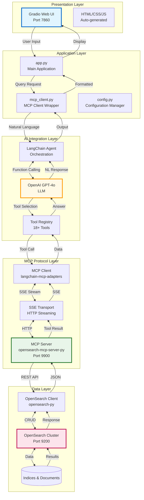

## Component Details

### 1. Presentation Layer

#### Gradio Web UI
```python
# Technology: Gradio 4.44+
# Features:
- Tab-based interface
- Markdown rendering
- Code syntax highlighting
- Interactive examples
- Real-time updates
```

**Capabilities:**
- Responsive design
- WebSocket support
- File upload/download
- Custom CSS themes

### 2. Application Layer

#### Main Application (app.py)
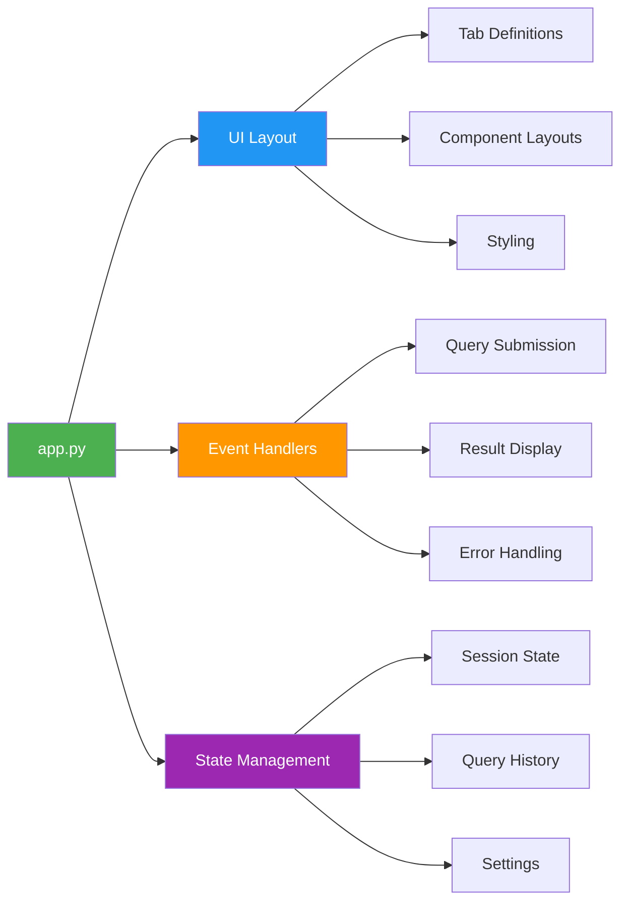

#### MCP Client Wrapper (mcp_client.py)
```python
class MCPClient:
    """
    Singleton pattern for MCP server communication
    """
    def __init__(self):
        self.client = None
        self.llm = None
        self.tools = None
    
    async def initialize(self):
        """Connect to MCP server and load tools"""
        
    async def query(self, question: str, verbose: bool = False):
        """Execute natural language query"""
        
    def get_tools_info(self):
        """Return metadata about available tools"""
```

#### Configuration Manager (config.py)
```python
class Settings(BaseSettings):
    """Pydantic settings with environment variable support"""
    opensearch_url: str
    opensearch_username: str
    opensearch_password: str
    openai_api_key: str
    mcp_server_port: int = 9900
```

### 3. AI Integration Layer

#### LangChain Agent Flow
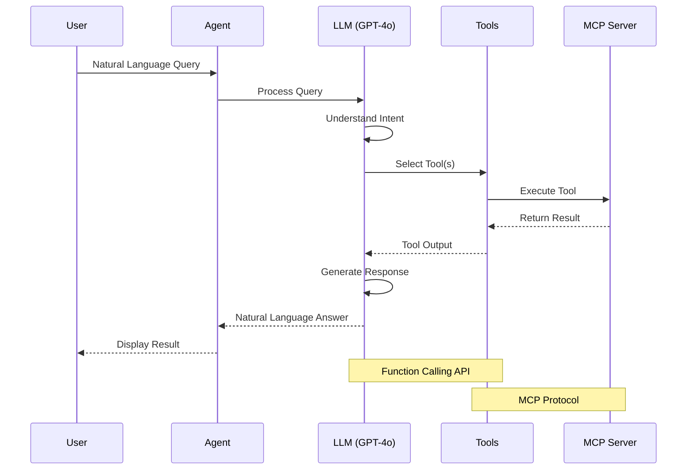

#### Tool Registry
| Tool Name | Category | Function | API Call |
|-----------|----------|----------|----------|
| list_indices | Index Mgmt | List all indices | GET _cat/indices |
| get_index | Index Mgmt | Get index details | GET /index |
| create_index | Index Mgmt | Create new index | PUT /index |
| delete_index | Index Mgmt | Delete index | DELETE /index |
| index_document | Documents | Add/update doc | PUT /index/_doc/id |
| get_document | Documents | Retrieve doc | GET /index/_doc/id |
| delete_document | Documents | Remove doc | DELETE /index/_doc/id |
| delete_by_query | Documents | Bulk delete | POST /index/_delete_by_query |
| search_documents | Search | Query docs | POST /index/_search |
| get_cluster_health | Cluster | Health status | GET _cluster/health |
| get_cluster_stats | Cluster | Statistics | GET _cluster/stats |
| list_aliases | Aliases | List aliases | GET _cat/aliases |
| get_alias | Aliases | Get index aliases | GET /index/_alias |
| put_alias | Aliases | Create alias | PUT /index/_alias/name |
| delete_alias | Aliases | Remove alias | DELETE /index/_alias/name |
| create_data_stream | Data Streams | Create stream | PUT _data_stream/name |
| get_data_stream | Data Streams | Get stream info | GET _data_stream/name |
| delete_data_stream | Data Streams | Delete stream | DELETE _data_stream/name |
| general_api_request | Advanced | Custom API | ANY /path |

### 4. MCP Protocol Layer

#### Communication Flow
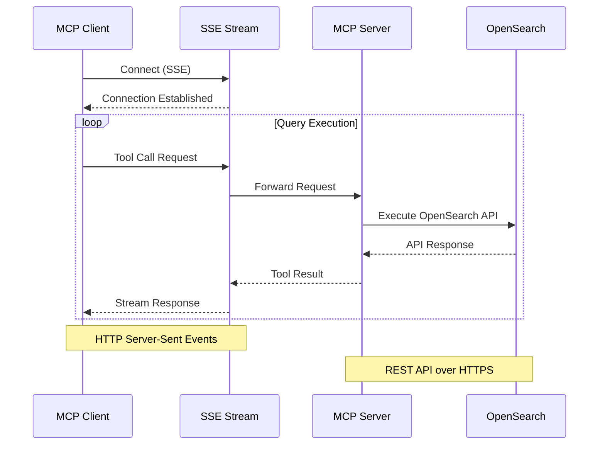

#### Protocol Specification
```json
{
  "protocol": "MCP",
  "version": "1.0",
  "transport": "sse",
  "endpoint": "http://localhost:9900/sse",
  "methods": [
    "tools/list",
    "tools/call",
    "resources/list",
    "resources/read"
  ]
}
```

### 5. Data Layer

#### OpenSearch Client Configuration
```python
client = OpenSearch(
    hosts=[{'host': 'localhost', 'port': 9200}],
    http_auth=('admin', 'password'),
    use_ssl=True,
    verify_certs=False,
    ssl_show_warn=False,
    timeout=30,
    max_retries=3,
    retry_on_timeout=True
)
```

#### Connection Pool
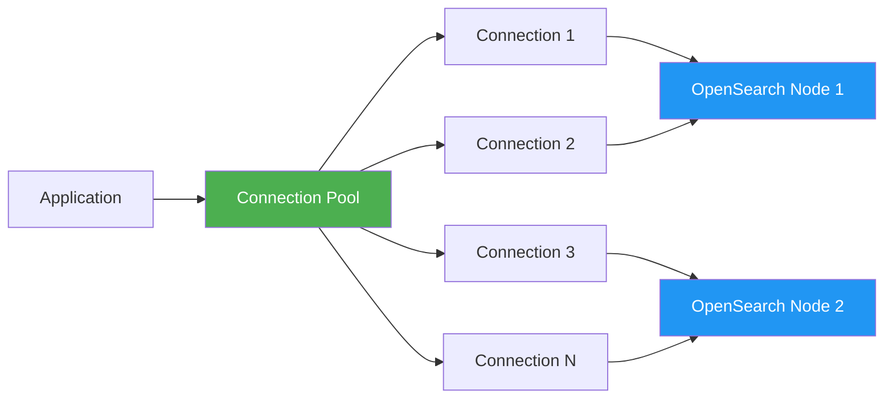

## Data Flow

### Request Flow
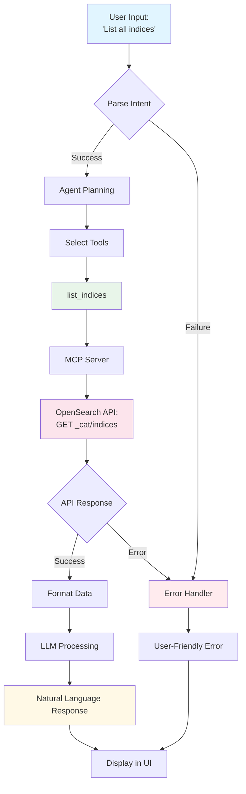

### Response Flow
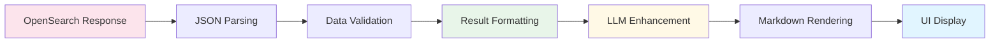

## Technology Stack

### Core Dependencies
```toml
gradio = "^4.44.0"              # Web UI framework
opensearch-mcp-server-py = "^0.4.0"  # MCP server
langchain = "^0.3.27"           # LLM orchestration
langchain-openai = "^0.3.33"    # OpenAI integration
opensearch-py = "^2.3.0"        # OpenSearch client
python-dotenv = "^1.0.0"        # Environment management
pydantic = "^2.0.0"             # Data validation
```

### Infrastructure Requirements
```yaml
minimum:
  python: "3.10"
  memory: "2GB"
  cpu: "2 cores"
  disk: "1GB"

recommended:
  python: "3.12"
  memory: "4GB"
  cpu: "4 cores"
  disk: "5GB"
```

## Security Architecture

### Authentication Flow
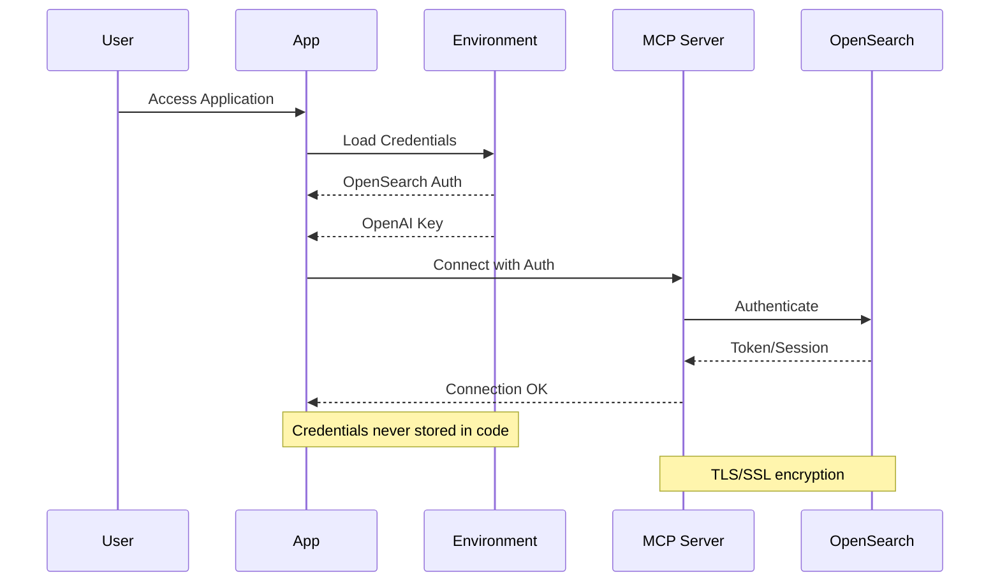

### Security Layers
1. **Transport Security**
   - TLS 1.3
   - Certificate validation
   - Encrypted connections

2. **Authentication**
   - Basic auth (username/password)
   - API key authentication
   - IAM role support (AWS)

3. **Authorization**
   - Role-based access control
   - Index-level permissions
   - Document-level security

4. **Data Protection**
   - Environment variables for secrets
   - No credentials in logs
   - Secure session management

## Performance Optimization

### Caching Strategy
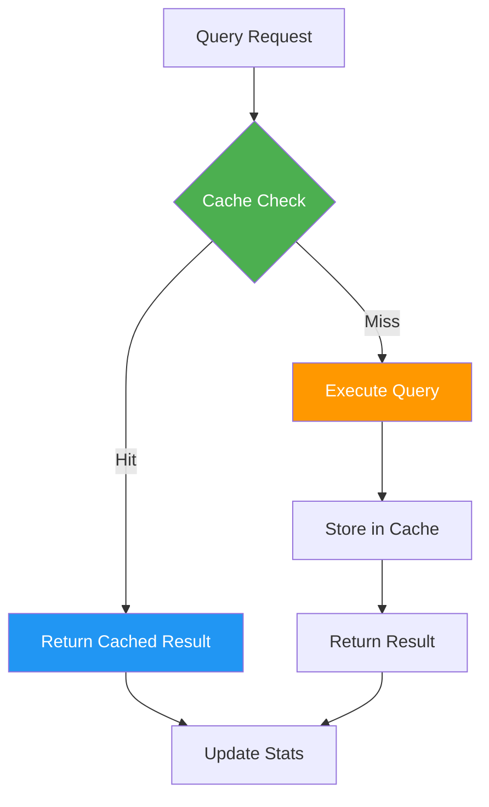

### Optimization Techniques
- **Connection Pooling**: Reuse OpenSearch connections
- **Query Caching**: Cache frequent queries (TTL: 5 minutes)
- **Result Pagination**: Limit results to 100 per page
- **Async Operations**: Non-blocking I/O with asyncio
- **Tool Preloading**: Load MCP tools at startup

### Performance Metrics
```python
# Target Performance
response_time_p50 = "< 500ms"
response_time_p95 = "< 2000ms"
response_time_p99 = "< 5000ms"
concurrent_users = 50
queries_per_second = 10
```

## Deployment Architecture

### Development Environment
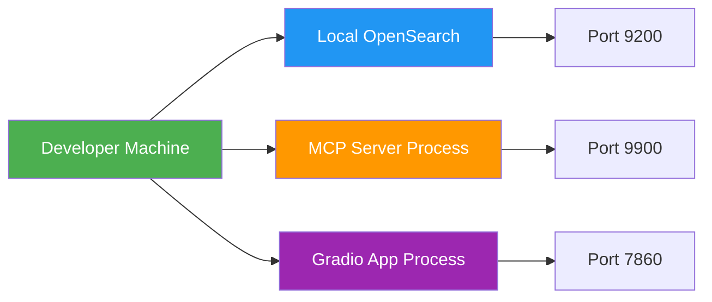

### Production Environment
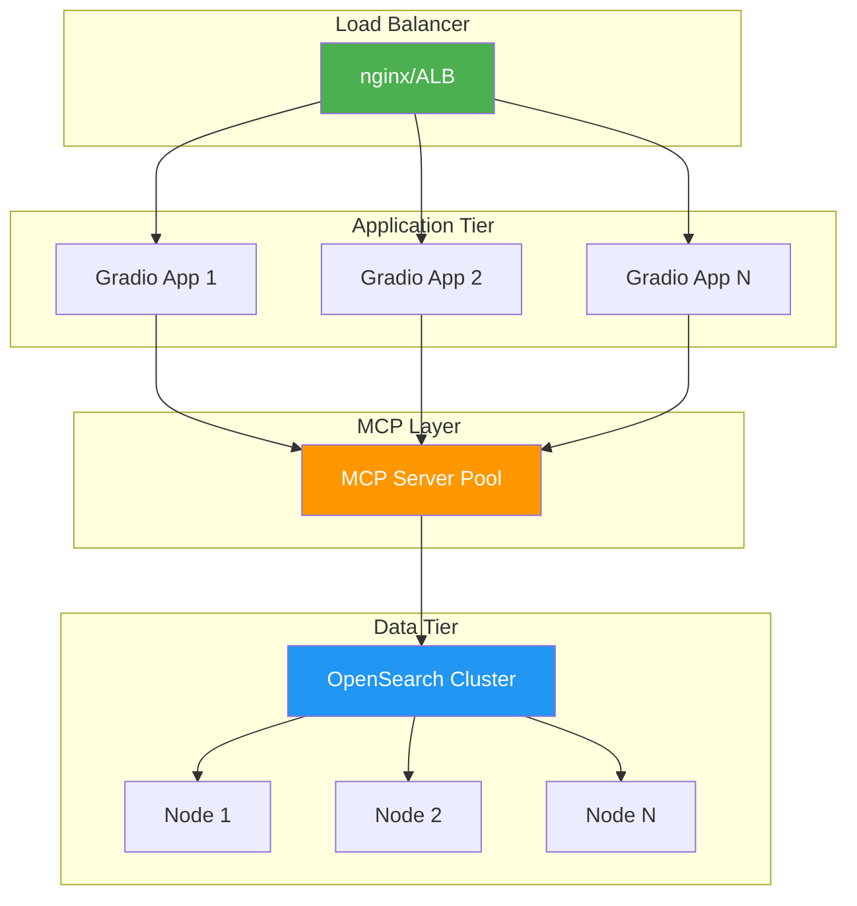

## Error Handling

### Error Flow
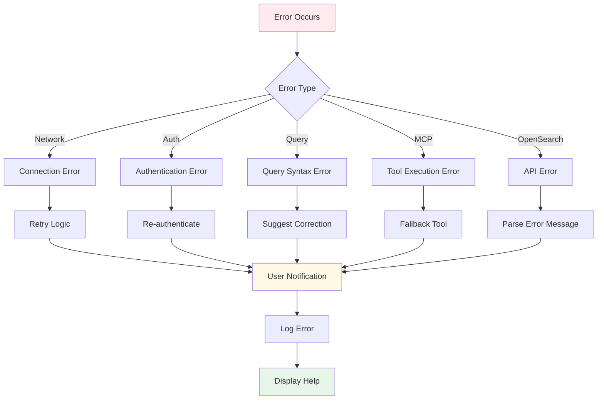

### Error Categories
1. **User Errors** (4xx)
   - Invalid input
   - Permission denied
   - Resource not found

2. **System Errors** (5xx)
   - Service unavailable
   - Internal error
   - Timeout

3. **Integration Errors**
   - OpenAI API errors
   - MCP server errors
   - OpenSearch errors

## Monitoring & Observability

### Metrics Collection
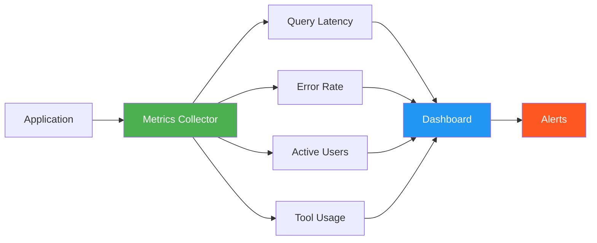

### Key Metrics
- **Application Metrics**
  - Requests per second
  - Response time (p50, p95, p99)
  - Error rate
  - Active sessions

- **MCP Metrics**
  - Tool call latency
  - Success/failure rate
  - Tool usage distribution

- **OpenSearch Metrics**
  - Query execution time
  - Index size
  - Document count
  - Cluster health

## Testing Strategy

### Test Pyramid
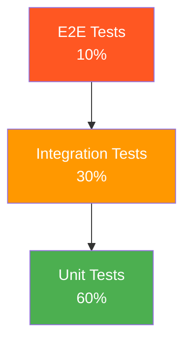

### Test Coverage
- **Unit Tests**: Individual functions and classes
- **Integration Tests**: MCP client, OpenSearch client
- **E2E Tests**: Full user workflows through UI
- **Performance Tests**: Load testing with locust
- **Security Tests**: Authentication, authorization

## API Reference

### MCP Client API
```python
# Initialize client
client = MCPClient(config)
await client.initialize()

# Execute query
result = await client.query(
    question="List all indices",
    verbose=True
)

# Get tools information
tools = client.get_tools_info()

# Cleanup
await client.close()
```

### Configuration API
```python
# Load from environment
config = Settings()

# Override settings
config = Settings(
    opensearch_url="https://custom:9200",
    mcp_server_port=9901
)

# Validate settings
config.validate()
```

## Troubleshooting Guide

### Common Issues

#### 1. MCP Server Not Responding
```bash
# Check if server is running
curl http://localhost:9900/health

# Restart server
python -m mcp_server_opensearch --transport stream --port 9900
```

#### 2. OpenSearch Connection Failed
```bash
# Verify cluster is running
curl -k https://localhost:9200

# Check credentials
curl -k -u admin:password https://localhost:9200
```

#### 3. OpenAI API Errors
```bash
# Verify API key
echo $OPENAI_API_KEY

# Test API
curl https://api.openai.com/v1/models \
  -H "Authorization: Bearer $OPENAI_API_KEY"
```

## Best Practices

### Code Organization
```
opensearch_mcp_server_app/
├── app.py                 # Main application
├── mcp_client.py          # MCP client wrapper
├── config.py              # Configuration
├── utils/
│   ├── formatting.py      # Output formatting
│   ├── validation.py      # Input validation
│   └── logging.py         # Logging utilities
├── docs/                  # Documentation
└── tests/                 # Test suite
```

### Development Workflow
1. Set up virtual environment
2. Install dependencies with uv
3. Configure environment variables
4. Start OpenSearch cluster
5. Start MCP server
6. Run application
7. Run tests
8. Commit changes

### Production Checklist
- [ ] Environment variables secured
- [ ] SSL certificates configured
- [ ] Monitoring enabled
- [ ] Backups configured
- [ ] Load testing completed
- [ ] Security audit passed
- [ ] Documentation updated
- [ ] Deployment runbook created

## Conclusion

This architecture provides a scalable, secure, and maintainable foundation for the OpenSearch MCP Server Educational App. The modular design allows for easy extension and customization while maintaining clean separation of concerns.

For questions or contributions, refer to the project repository and community guidelines.
