# Gradio Application Documentation (`app.py`)

## 📋 Overview

The `app.py` module is a comprehensive educational web application built with Gradio that provides an interactive interface for learning OpenSearch through natural language queries. It integrates with the MCP (Model Context Protocol) server and GPT-4 to translate user questions into OpenSearch operations.

## 🏗️ Architecture Overview


## 🚀 Application Startup Flow


## 🎨 UI Component Structure


## 🔄 Query Processing Flow


## 📑 Tab Structure & Content


### Tab-Specific Content


## 🎯 Initialize App Function


## 🔍 Process Query Function

```mermaid
flowchart TD
    Start([process_query called]) --> CheckInput{question.strip empty?}
    
    CheckInput -->|Yes| ReturnWarning[Return warning message]
    CheckInput -->|No| TryBlock{Try}
    
    TryBlock -->|Exception| CatchError[Catch exception]
    CatchError --> ReturnError[Return unexpected error]
    
    TryBlock -->|Success| ExecuteQuery[execute_query call]
    ExecuteQuery --> GetResult[Get result dict]
    GetResult --> CheckSuccess{Check if success?}
    
    CheckSuccess -->|Yes| FormatSuccess[Format success output]
    FormatSuccess --> AddResultHeader[Add ✅ Success header]
    AddResultHeader --> AddResult[Add result text]
    
    AddResult --> CheckDetails{show_details enabled?}
    CheckDetails -->|Yes| BuildDetails[Build details string]
    BuildDetails --> AddToolCount[Add tool calls count]
    AddToolCount --> AddProcess[Add process steps]
    AddProcess --> ReturnBoth[Return output, details]
    
    CheckDetails -->|No| ReturnOutputOnly[Return output, empty]
    
    CheckSuccess -->|No| FormatError[Format error message]
    FormatError --> AddErrorHeader[Add ❌ Error header]
    AddErrorHeader --> AddErrorMsg[Add error message]
    AddErrorMsg --> AddTips[Add troubleshooting tips]
    AddTips --> ReturnErrorMsg[Return error_msg, empty]
    
    ReturnWarning --> End([Return to UI])
    ReturnError --> End
    ReturnBoth --> End
    ReturnOutputOnly --> End
    ReturnErrorMsg --> End
    
    style Start fill:#4CAF50,color:#fff
    style ExecuteQuery fill:#2196F3,color:#fff
    style FormatSuccess fill:#4CAF50,color:#fff
    style FormatError fill:#F44336,color:#fff
    style End fill:#4CAF50,color:#fff
```



## 🏗️ Tab Creation Functions


## 📊 Data Flow Diagram


## 🎨 Styling & Theming


## 🔗 Component Interactions


## 🚦 State Management


## 📋 Educational Content Strategy


## 🧩 Function Responsibilities


## 🔄 Event Handling


## 📱 Responsive Layout


## 🎓 Example Queries by Tab


## 🚀 Launch Configuration


## 🔐 Security Considerations


## 📈 Performance Optimization

```mermaid
flowchart TD
    A[Performance Features] --> B[Async Execution]
    B --> C[Non-blocking I/O]
    C --> D[Responsive UI]
    
    A --> E[Lazy Loading]
    E --> F[Tools loaded once]
    F --> G[Cached in MCPClient]
    
    A --> H[Connection Reuse]
    H --> I[Singleton pattern]
    I --> J[Persistent connections]
    
    A --> K[Efficient Rendering]
    K --> L[Markdown formatting]
    L --> M[Minimal DOM updates]
    
    style A fill:#4CAF50,color:#fff
    style B fill:#2196F3,color:#fff
    style E fill:#FF9800,color:#fff
    style H fill:#9C27B0,color:#fff
```

## 🐛 Error Handling Strategy

```mermaid
graph TB
    A[Error Types] --> B[Connection Errors]
    B --> C[MCP server down]
    C --> D[Display: Check MCP server]
    
    A --> E[Query Errors]
    E --> F[Invalid syntax]
    F --> G[Display: Error with tips]
    
    A --> H[OpenSearch Errors]
    H --> I[Index not found]
    I --> J[Display: Descriptive message]
    
    A --> K[LLM Errors]
    K --> L[API limit reached]
    L --> M[Display: Try again later]
    
    style A fill:#F44336,color:#fff
    style B fill:#FF9800,color:#fff
    style E fill:#FF5722,color:#fff
    style H fill:#F44336,color:#fff
```

## 🧪 Usage Flow

```mermaid
journey
    title User Journey Through App
    section Arrival
      Open app in browser: 5: User
      See welcome page: 5: User
      Read introduction: 4: User
    section Learning
      Choose feature tab: 5: User
      Read educational content: 4: User
      View diagrams: 5: User
    section Practice
      Click example query: 5: User
      Review pre-filled text: 4: User
      Click submit: 5: User
      See results: 5: User
    section Experimentation
      Write custom query: 4: User
      Enable show details: 3: User
      Submit query: 4: User
      Analyze execution: 4: User
```

## 📚 Integration Points

```mermaid
graph TB
    A[app.py] -->|Imports| B[config.py]
    A -->|Imports| C[mcp_client.py]
    
    B -->|Provides| D[Settings]
    D --> E[app_title]
    D --> F[app_port]
    D --> G[app_share]
    
    C -->|Provides| H[get_mcp_client]
    C -->|Provides| I[execute_query]
    
    H --> J[MCPClient instance]
    I --> K[Query execution]
    
    style A fill:#4CAF50,color:#fff
    style B fill:#2196F3,color:#fff
    style C fill:#FF9800,color:#fff
```

## 🎯 Key Design Principles

1. **Educational First**: Every tab teaches concepts before practice
2. **Progressive Complexity**: Simple examples → Advanced features
3. **Visual Learning**: Diagrams and clear explanations
4. **Hands-on Practice**: Interactive examples with real feedback
5. **Error Guidance**: Helpful tips when things go wrong
6. **Self-Contained**: All resources and examples included

## 🔄 Complete User Flow

```mermaid
stateDiagram-v2
    [*] --> LandingPage: User opens app
    LandingPage --> ReadWelcome: View welcome tab
    ReadWelcome --> ChooseTab: Select feature
    
    ChooseTab --> ReadConcept: Read educational content
    ReadConcept --> ViewExamples: See example queries
    ViewExamples --> TryExample: Click an example
    
    TryExample --> ReviewQuery: Query populates input
    ReviewQuery --> Submit: Click submit
    Submit --> Processing: Execute query
    Processing --> ViewResult: See formatted answer
    
    ViewResult --> TryMore: Try another
    ViewResult --> CustomQuery: Write own query
    
    TryMore --> ViewExamples
    CustomQuery --> Submit
    
    ViewResult --> [*]: Done learning
```

## 📚 Related Files

- `mcp_client.py` - MCP client integration
- `start_mcp_server.py` - MCP server management
- `config.py` - Application configuration
- `.env` - Environment variables

---

**Version**: 1.0  
**Last Updated**: 2025-11-30  
**Maintainer**: OpenSearch MCP Demo Team
