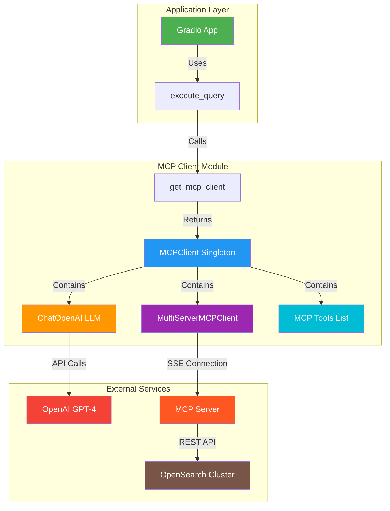
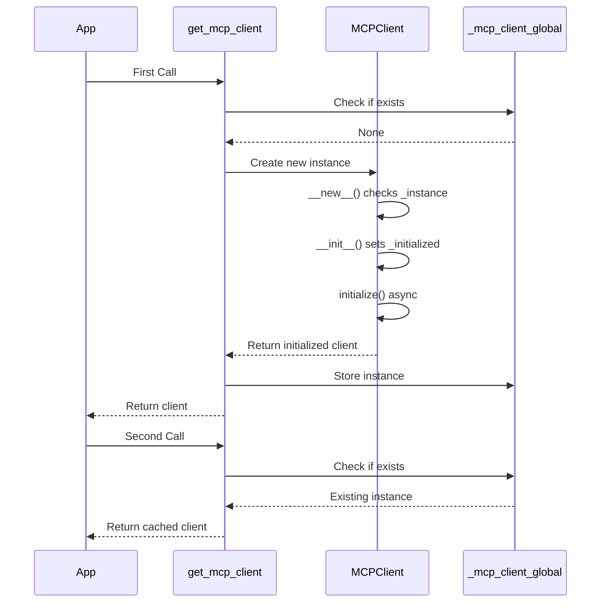
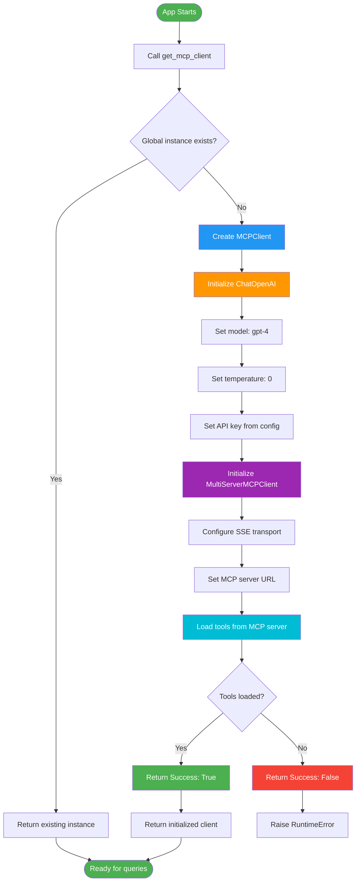
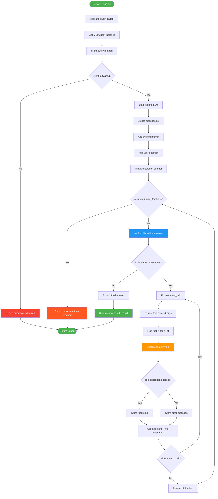
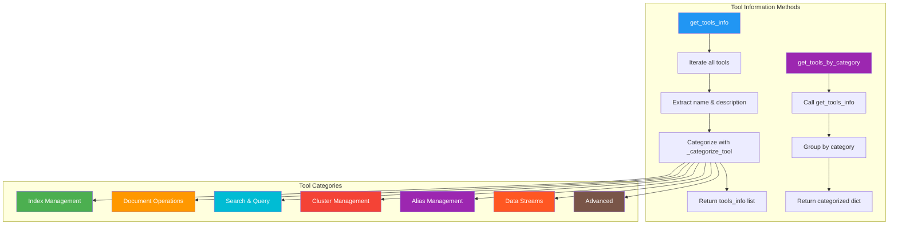
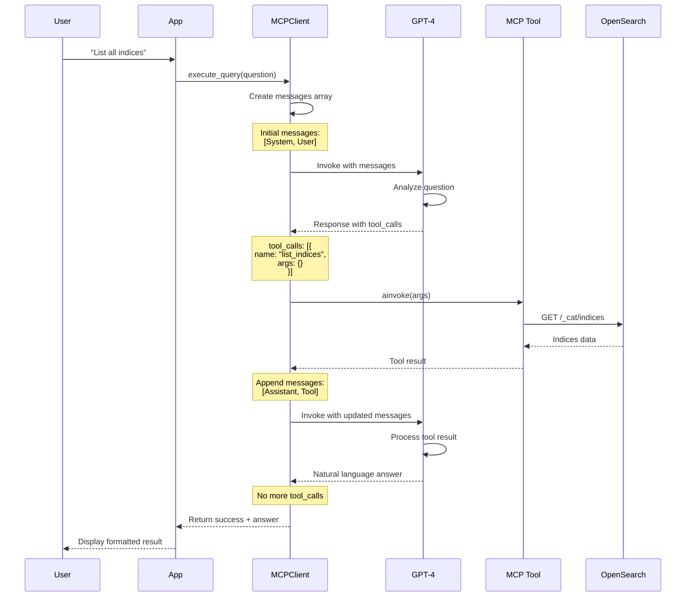
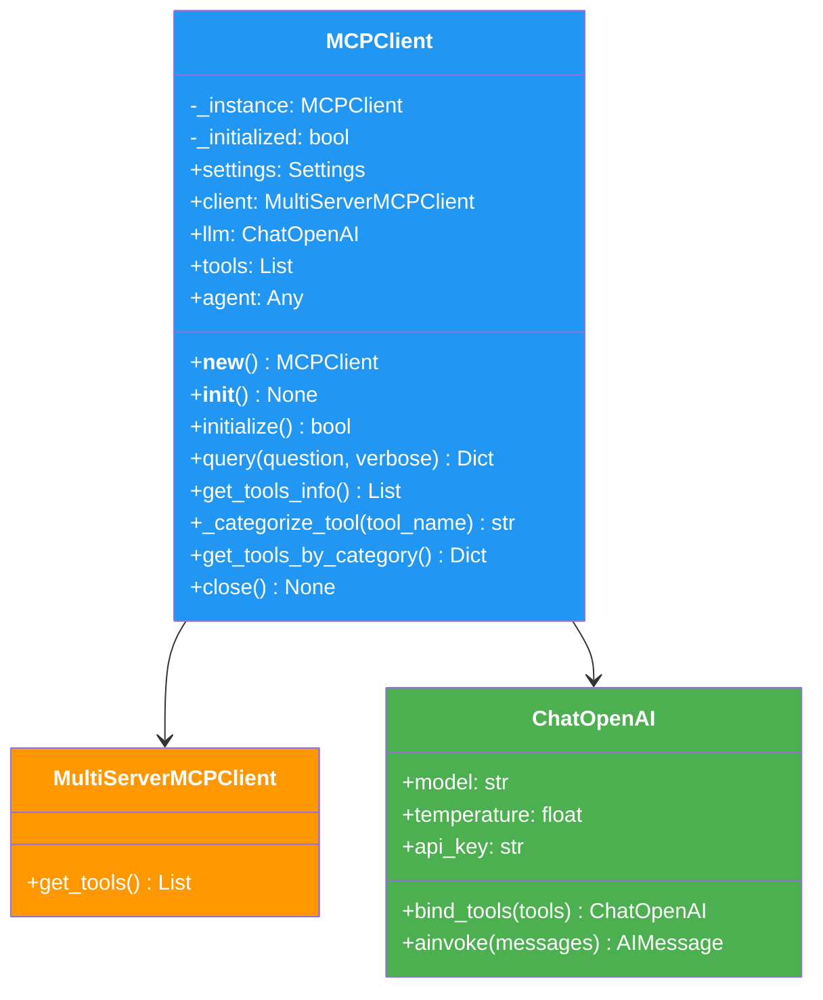
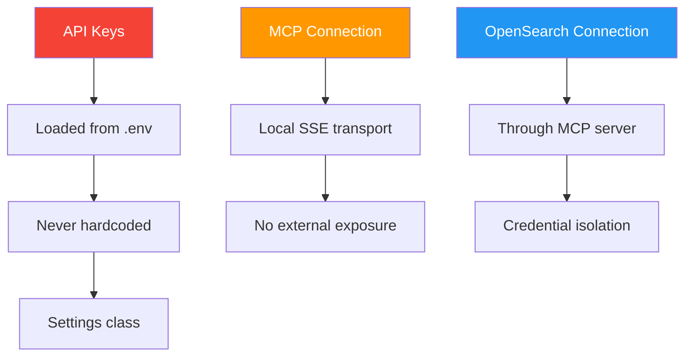
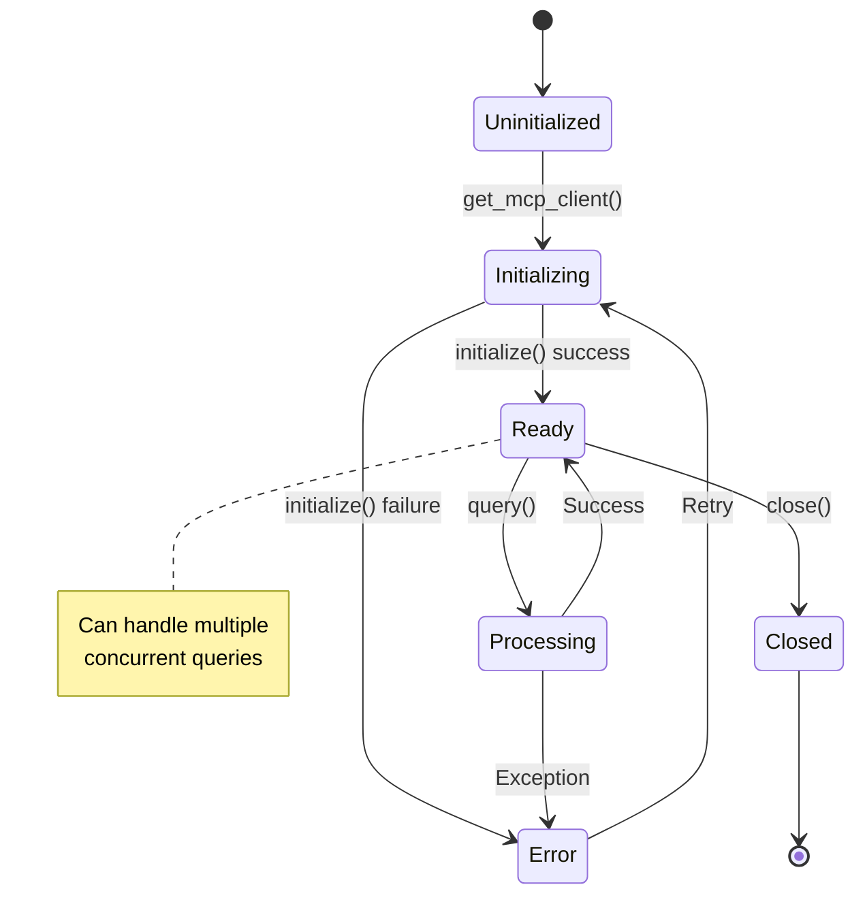

# MCP Client Documentation (`mcp_client.py`)

## 📋 Overview

The `mcp_client.py` module provides a sophisticated wrapper around the OpenSearch MCP (Model Context Protocol) server, enabling natural language interactions with OpenSearch through an AI agent powered by OpenAI's GPT models.

## 🏗️ Architecture Overview



## 🔄 Singleton Pattern Implementation



### Why Singleton?

- **Resource Efficiency**: Maintains single connection to MCP server
- **State Preservation**: Keeps tools loaded across multiple queries
- **Connection Pooling**: Reuses OpenAI API client
- **Memory Optimization**: Prevents duplicate heavy objects

## 🚀 Initialization Flow



## 🤖 Query Execution Flow (Agent Loop)



## 🔧 Tool Management



## 💬 Message Flow in Agent Loop



## 📊 Data Structures

### MCPClient Class Attributes



### Query Response Format

```json
{
  "success": true,
  "result": "Natural language answer from GPT-4",
  "error": null,
  "metadata": {
    "tool_calls": [
      {
        "tool": "list_indices",
        "args": {},
        "result": "Index data..."
      }
    ],
    "iterations": 2
  }
}
```

## 🎯 Key Features

### 1. **Asynchronous Operations**
- All I/O operations use `async`/`await`
- Non-blocking tool execution
- Efficient resource utilization

### 2. **Error Handling**


### 3. **Tool Categorization**
Automatically categorizes tools based on naming patterns:
- `*index*` → Index Management
- `*document*`, `*query*` → Document Operations
- `*search*` → Search & Query
- `*cluster*`, `*health*` → Cluster Management
- `*alias*` → Alias Management
- `*stream*` → Data Streams
- Default → Advanced

### 4. **Verbose Mode**
When enabled, prints real-time tool execution details:
```
🔧 Calling tool: search_documents
   Args: {'index': 'ecommerce', 'body': {...}}
```

## 🔐 Security Considerations



## 📈 Performance Optimization

### Singleton Benefits
- **Connection Reuse**: Single MCP client instance
- **Tool Caching**: Tools loaded once at initialization
- **Memory Efficiency**: Prevents object duplication

### Async Benefits
- **Non-blocking I/O**: Multiple queries can be processed concurrently
- **Responsive UI**: Gradio interface remains responsive during queries
- **Efficient Resource Usage**: Better CPU utilization

## 🧪 Usage Examples

### Basic Query
```python
from mcp_client import execute_query

result = await execute_query("List all indices")
print(result['result'])
```

### Verbose Query
```python
result = await execute_query(
    "Find orders over $100", 
    verbose=True
)
```

### Get Tools Information
```python
from mcp_client import get_mcp_client

client = await get_mcp_client()
tools = client.get_tools_info()
categorized = client.get_tools_by_category()
```

## 🔄 Lifecycle Management



## 🐛 Troubleshooting

### Common Issues

1. **"MCP client not initialized"**
   - Ensure MCP server is running
   - Check `mcp_server_url` in config
   - Verify network connectivity

2. **"Max iterations reached"**
   - Query too complex
   - Tool execution failures
   - LLM stuck in loop

3. **Tool execution errors**
   - OpenSearch connection issues
   - Invalid query parameters
   - Missing index or documents

## 📚 Related Files

- `config.py` - Settings and configuration
- `start_mcp_server.py` - MCP server startup script
- `app.py` - Gradio application using this client

---

**Version**: 1.0  
**Last Updated**: 2025-11-30  
**Maintainer**: OpenSearch MCP Demo Team
