# MCP Server Startup Script Documentation (`start_mcp_server.py`)

## 📋 Overview

The `start_mcp_server.py` script is a convenient helper utility that manages the lifecycle of the OpenSearch MCP (Model Context Protocol) server. It handles server initialization, health checks, port management, and graceful shutdown.

## 🏗️ Architecture Overview


## 🔄 Detailed Execution Flow


## 🔍 Port Availability Check


## 📦 Subprocess Command Construction


### Example Command
```bash
python -m mcp_server_opensearch --transport stream --port 9900 --config mcp_server_config.yaml
```

## 💊 Health Check Loop

```mermaid
flowchart LR
    Start([Server Started]) --> InitCounter[counter = 0]
    InitCounter --> Loop{counter < 30?}
    
    Loop -->|Yes| TryHealth[GET /health]
    TryHealth --> CheckResponse{Status 200?}
    
    CheckResponse -->|Yes| Success[✅ Server Ready]
    CheckResponse -->|No| Sleep[Sleep 1s]
    
    Sleep --> Increment[counter++]
    Increment --> PrintProgress[Print attempt X/30]
    PrintProgress --> Loop
    
    Loop -->|No| Failed[⚠️ Health check failed]
    
    Success --> Ready([Ready for connections])
    Failed --> Warning([Show logs warning])
    
    style Start fill:#4CAF50,color:#fff
    style TryHealth fill:#2196F3,color:#fff
    style Success fill:#4CAF50,color:#fff
    style Failed fill:#FF9800,color:#fff
```



## 🔄 Process Lifecycle States


## 🔐 Environment & Configuration


## 🛡️ Error Handling


## 📊 Output Messages

### Startup Messages


### Ready Messages

```mermaid
graph TD
    A[✅ MCP Server is ready!] --> B[You can now start the Gradio app]
    B --> C[python app.py]
    C --> D[Press Ctrl+C to stop]
    
    style A fill:#4CAF50,color:#fff
    style C fill:#2196F3,color:#fff
```


### Error Messages

```mermaid
graph TD
    A[⚠️ Port already in use] --> B[Do you want to continue?]
    C[❌ Package not found!] --> D[pip install opensearch-mcp-server-py]
    E[⚠️ Health check failed] --> F[Check server logs]
    
    style A fill:#FF9800,color:#fff
    style C fill:#F44336,color:#fff
    style E fill:#FF9800,color:#fff
```


## 🎯 Key Features

### 1. **Port Conflict Detection**
- Checks if port is already in use
- Prompts user before proceeding
- Prevents accidental multiple instances

### 2. **Automatic Configuration Loading**
- Detects `mcp_server_config.yaml`
- Loads `.env` file if available
- Passes environment to subprocess

### 3. **Health Monitoring**
- Polls `/health` endpoint
- Retries up to 30 times
- 1-second intervals
- Clear progress indication

### 4. **Graceful Shutdown**
- Catches Ctrl+C signal
- Terminates subprocess cleanly
- Waits for process exit
- Prints confirmation message

## 🔧 Process Management

```mermaid
sequenceDiagram
    participant User
    participant Script
    participant Subprocess
    participant MCP Server
    participant OpenSearch
    
    User->>Script: python start_mcp_server.py
    Script->>Script: Check port availability
    Script->>Subprocess: Popen(command)
    Subprocess->>MCP Server: Start process
    
    loop Health Check (max 30)
        Script->>MCP Server: GET /health
        alt Server Ready
            MCP Server-->>Script: 200 OK
        else Not Ready
            MCP Server-->>Script: No response
            Script->>Script: Sleep 1s
        end
    end
    
    MCP Server->>OpenSearch: Test connection
    OpenSearch-->>MCP Server: Connection OK
    
    Script-->>User: ✅ Server ready
    
    Note over Script,MCP Server: Server running...
    
    User->>Script: Ctrl+C
    Script->>Subprocess: terminate()
    Subprocess->>MCP Server: SIGTERM
    MCP Server->>MCP Server: Cleanup
    MCP Server-->>Subprocess: Exit
    Subprocess-->>Script: Process ended
    Script-->>User: ✅ Server stopped
```



## 🧪 Usage Examples

### Basic Usage
```bash
python start_mcp_server.py
```

### Custom Port
```bash
MCP_SERVER_PORT=9999 python start_mcp_server.py
```

### With Configuration
```bash
# Assumes mcp_server_config.yaml exists
python start_mcp_server.py
```

## 🐛 Troubleshooting

### Common Issues

1. **Port Already in Use**
   ```
   ⚠️ Port 9900 is already in use
   ```
   - **Solution**: Stop existing MCP server or choose different port

2. **Package Not Found**
   ```
   ❌ MCP server package not found!
   ```
   - **Solution**: `pip install opensearch-mcp-server-py`

3. **Health Check Timeout**
   ```
   ⚠️ Server started but health check failed
   ```
   - **Solution**: Check OpenSearch connection, review logs

4. **Permission Denied**
   ```
   Error: Permission denied on port 9900
   ```
   - **Solution**: Use port > 1024 or run with appropriate permissions

## 📈 Performance Considerations

### Subprocess vs Threading


### Health Check Timing
- **30 attempts** × **1 second** = **30 seconds max wait**
- Balances responsiveness vs reliability
- Prevents indefinite hanging
- User can see progress

## 🔄 Integration with App


## 📚 Related Files

- `mcp_client.py` - Client that connects to this server
- `app.py` - Gradio application using the MCP server
- `mcp_server_config.yaml` - Server configuration
- `.env` - Environment variables

## 🔗 External Dependencies

- `mcp_server_opensearch` - The actual MCP server package
- `requests` - For health check HTTP calls
- `python-dotenv` - Optional, for loading `.env` files
- `subprocess` - Built-in, for process management

---

**Version**: 1.0  
**Last Updated**: 2025-11-30  
**Maintainer**: OpenSearch MCP Demo Team
