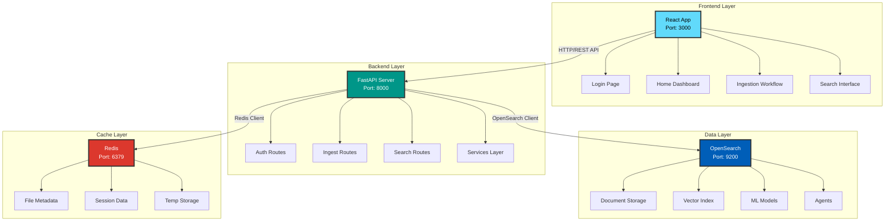
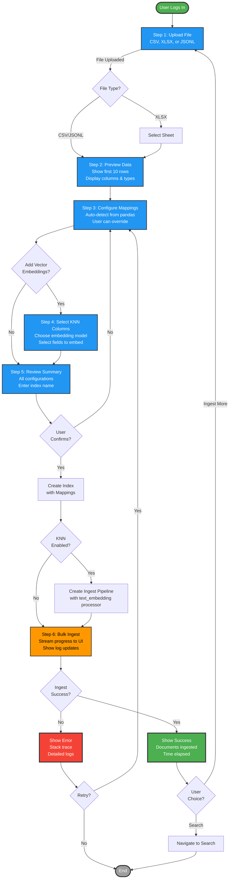
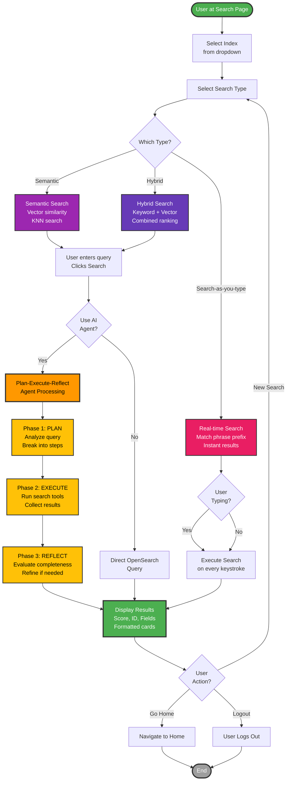
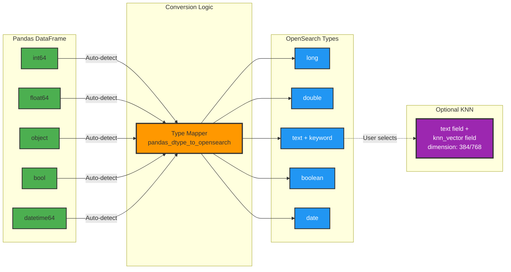
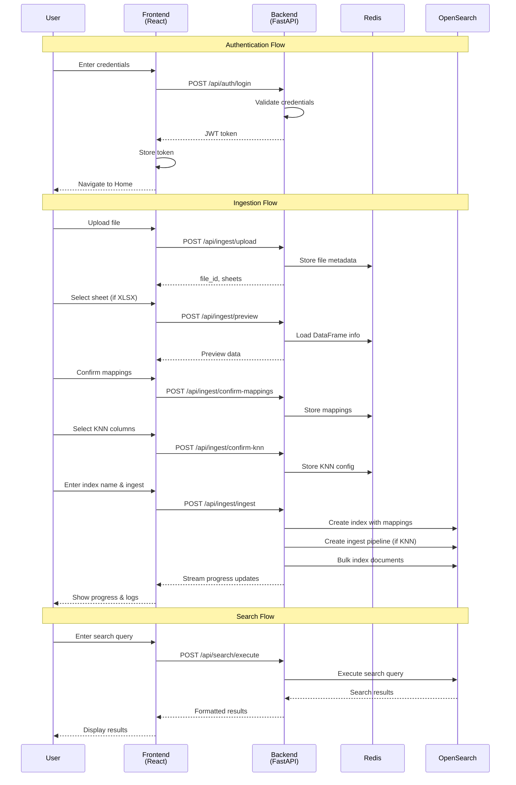

# Architecture and Flow Diagrams

This document contains colorful Mermaid diagrams explaining the system architecture and data flows.

## System Architecture

## Ingestion Workflow

## Search Flow

## Data Type Mapping Flow

## Component Interaction Sequence

---

## Color Legend

- 🟦 **Blue**: Core services and data processing
- 🟩 **Green**: Success states and start/end points
- 🟧 **Orange**: Processing and transformation steps
- 🟥 **Red**: Error states and warnings
- 🟪 **Purple**: Advanced features (AI/ML)
- 🟨 **Yellow**: Agent processing phases
- ⬜ **Gray**: End states and neutral actions
