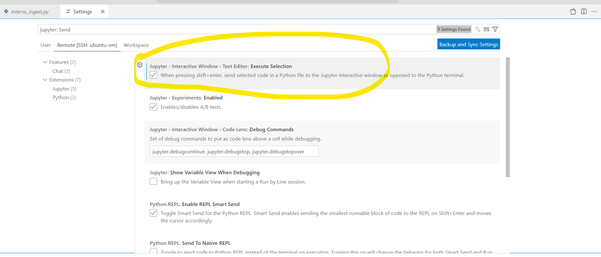

# OPENSEARCH (INTERMEDIATE) COURSE
  
This repo contains tutorials, code, documentation that drives my opensearch course content at intermediate. Throughout the course: `OS=opensearch` & `ES=elasticsearch`

# UDEMY
The previous course (BASIC level) is published here:

# COURSE MODULES
**High Level Intro**  
[)](https://youtu.be/fP-jasNntB4) 

| 🛠️ **OpenSearch - Getting Started**                              | 💻 **Installation and System Requirements**                       | 🔍 **OpenSearch Concepts**                                       | 📖 **OpenSearch - Text Analysis**                           | 🔗 **OpenSearch - Traditional and AI/ML Search**                           | 🤖 **Machine Learning**                                                      | 🧩 **Agents and Tools**                                                      | 📊 **OpenSearch Dashboards \| Observability**                                    | 🗂️ **Data Prepper Intro**                                      | 🌐 **Real-Time Projects**                           |
|:----------------------------------------------------------------|:-----------------------------------------------------------------|:----------------------------------------------------------------|:-----------------------------------------------------------|:-----------------------------------------------------------------------------|:-----------------------------------------------------------------------------|:-----------------------------------------------------------------------------|:--------------------------------------------------------------------------------|:---------------------------------------------------------------|:------------------------------------------------------|
| 👋 [Who are we \| Housekeeping \| Machine resources needed](https://youtu.be/5UpPU4bu7yk)       | 🛠️ [System & Network Requirements \| Configuration](https://youtu.be/ppRKzRz7w4Y)                 | 🧠 What is Search - Analogy                                     | 🛠️ Demo: ElasticSearch minimal                          | 🔍 Search Methods \| Query Languages \| Performance \| Relevance          | 🧬 ML Commons Plugin \| Algorithms \| Using LLM Models           | ⚙️ Overview \| Types of Agents \| Demo Flow Agent (RAG)          | 🌟 Getting Started \| Query Languages \| Components              | 📋 Data Prepper \| Use Cases \| Concepts                          | 🚀 Project1: Load, create, and restore within OpenSearch |
| 🗃️ [PreRequisites \| Why Elasticsearch \| Motivation](https://youtu.be/3QB_5XtZHww)             | 🔌 [Plugins \| Upgrading](https://youtu.be/t6mrqDwLHkA)                                           | 🔗 What is OpenSearch \| History \| Capabilities               | 🛠️ Demo: ES & OS minimal (continued)                     | 🔎 Search Results \| Highlight \| Paginate \| Sort \| AutoComplete        | 🤖 Demo: Pretrained sentence transformer model                  | ⚙️ Demo: RAG with non-supported transformers                   | 📊 Dashboards End-to-End walkthrough                               | 🛠️ Data Prepper \| vs. Logstash \| Sources \| Processors         | 🚀 Project2: Migrate from ElasticSearch to OpenSearch    |
| 🗂️ [Demo: Folders \| Course Overview](https://youtu.be/qynJsWioyKY)                             | ⚙️ [OS client libraries](https://youtu.be/VdqRL0hruZU)                                            | 🔍 Types of Searches                                           | 🛠️ Text Analysis Pipeline                                 | 🔍 Retrieve Fields \| Keyword Search                              | 🤖 Demo: Pretrained ONNX Sentence Transformer                   | ⚙️ Demo: RAG with interns dataset                              | 📈 Demo: Analyzing Data                                           | 🛠️ Demo: Log ingestion Apache Logs                                | 🚀 Project3: Geo Spatial Analysis                        |
| 📂 Demo: Datasets \| Downloads                                  | 🛠️ [AWS EC2 Setup: Install and Access](https://youtu.be/C8rzLRw6ARs)                              | 🏭 Use Cases By Industry                                       | 🛠️ Analyzers \| Components \| Use Cases                   | 🔎 Demo: Search Data                                             | 🤖 Demo: Local Torch Transformers                              | ⚙️ Tools \| Rerank                                             | 🎨 Custom Branding                                                | 📊 Demo: Log Ingestion Open Telemetry Logs                        |                                                       |
|                                                                 | 🛠️ [EC2 Setup Continued](https://youtu.be/qZH8YVk2HyY)                                            | ⚖️ Competitive Analysis: OpenSearch vs. Elasticsearch          | 🔠 Tokenizers \| Filters                                   | 🔍 kNN Search \| kNN Index                                   | 🤖 Demo: Sparse Encoding Transformers                          | ⚙️ Conversational Flow Agent                                   | 📊 Observability \| Integrations \| Notebooks                    |                                                                |                                                       |
|                                                                 | 🛠️ Local Machine Setup                                            | 🔗 OS Architecture: Shards \| Inverted Index                   | 🛠️ Demo: Mappings                                         | 🔍 Neural Search                                             | 🤖 Demo: Cross Encoder Transformers                            | ⚙️ Knowledge Base Agents                                      | 📊 Reporting \| Search Relevance                                   |                                                                |                                                       |
|                                                                 |                                                                  |                                                               | 🔠 Normalization \| Techniques \| Filters                 | 🤖 Intuition \| LLM Analogies                               | 🤖 External Model: OpenAI Integration                          | ⚙️ RAG: Dynamic Index Selection                               |                                                                 |                                                                |                                                       |
|                                                                 |                                                                  |                                                               |                                                           | 🧠 Sentence Transformers                                   | 🔌 Connector Blueprints \| Processing                         | ⚙️ Chatbot Agents                                             |                                                                 |                                                                |                                                       |
|                                                                 |                                                                  |                                                               |                                                           | 📦 Vector Indexing                                          |                                                               |                                                               |                                                                 |                                                                |                                                       |
|                                                                 |                                                                  |                                                               |                                                           | 🔍 kNN Search Continued                                    |                                                               |                                                               |                                                                 |                                                                |                                                       |

# PREREQUISITES FOR THE COURSE
- **Human taking the course**: 
  - Eagerness and excitement to learn and understand how `search` worked traditionally vs. `AI/Ml-driven search` from ground up
  - Basics of being able to `navigate in a linux environment` (e.g. ls, rm, cd)
  - Basics of `docker` / container technology (including docker compose)
  - `Basic python` coding
  - Basics of server/client tech
- **Machine Resources**: See below

# MOTIVATION FOR THE COURSE
- There are many ES courses online and it is a pretty mature platform in startups, mid-level or enterprise contexts. 
- Just search for `List top 25 enterprise companies using elasticsearch` on google/perplexity (also search for `top 25 using OpenSearch`). In the search results, note that `Oracle` switched from ES > OS for their PeopleSoft's search capabilities
- The clouds have already changed the software licensing incentives and model structures in the world. So why `continue paying for software licenses especially when you have an equivalent` or better open source equivalent (you anyways cannot get away paying for support, skills and large scale needs like data center infra, AI models)
- You already give away the most precious asset (data) to the search platform, so why still pay additional for authN/authZ , UI and other commoditized software pieces - Reduce it !
- `Opensearch` is relatively new and you can almost count the number of courses available out there. Since I have used both (ES and OS)
  - I believe there is a good market space for OS to positively disrupt, 
  - 80% of your initial dev journey (until you prove a concept) doesn't need to have the trial license sword hanging on you
- Many more (follow the course) 

# ORGANIZATION OF THE COURSE
- **Tutorial**: In each of the main folder, there is subfolder [my_tutorial](./opensearch/my_tutorial/), that contains the majority of what I instruct. 
- **Code**: All code is inside [scripts](./opensearch/my_tutorial/scripts/) subfolder and [notebook](./opensearch/my_tutorial/notebooks/) subfolder. Contains python, shell, docker compose files etc.
- **Data**: subfolder **[0. DATA](./0.%20DATA/)** contains all datasets used for this course. All data is provided as separate link to download (because we cannot check in data into repo)

# PRESENTATIONS 
- `No PPTs for this course` but instead...
- **I have used ONLY Markdown files for presentation content & explaining concepts**. The .md files are co-located with code files and also aggregated at module level (That means if you checkout this repo and follow the videos - you probably don't need any other resources. Less switching time > less switching context > more memory retained)
  - Does that mean I have to open the repo every time to learn ? Nopes
  - Is there a way for me to review the content without having to open vs code :) Yes indeed!
  - You can export the presentation content for the entire course OR pick and choose specific modules/sub modules into pdf, html etc.
  - **Why did I choose this way instead of .ppt format etc. ?** This course is AI heavy and as you get deeper into AI agents, you would soon realize that markdown format is how agents transfer or exchange context. So I practice-before-preach i.e. use Markdown (and later export to various formats like ppt , pdf, html etc.) and believe that the student taking the course would benefit immensely by adopting this standard (thank me later!)
- **Markdown preview enhanced** - vs code extension - can render markdown into a presentable format and can export to pdf, ppt, html etc. We will use this for all presentation modes. You can also export all .md files into pdf to learn concepts on the go if you wish.
- **Alternatives** - There are many more alternatives like pandoc, marp etc. to render markdown into presentation formats. For e.g. marp can export into pptx , however it doesn't support mermaid diagram rendering (yet). Otherwise marp would have been a good choice to bridge more conventional folks (who like pptx) with non-conventional (who like reveal.js etc.)

# HARDWARE, TOOLS & SOFTWARE
- **HARDWARE**: Bare metal or virtual OS as long as you have at least 16GB RAM, 4 CPUs and 50GB storage (8gb bare metal RAM was sufficient for BASIC course, however YMMV if you use 8GB for this course)
- **MAIN** OPENSEARCH (of course) 3.3.3
- **SERVER OPERATING SYSTEM**: Linux (ubuntu 20.04 or 22.04). This is where we launch opensearch server and execute scripts
- **CLIENT OPERATING SYSTEM**: This is where we launch the IDE and our primary interface for the course. This can be `windows` or `linux` or `mac`
- **DOCKER**: Docker version 28.4.0, build d8eb465 (frankly any latest version should work)
- **PROGRAMMING LANGUAGES**: Python 3.12.11 (or greater) and modules, shell, SQL/DQL (comes with opensearch)
- **IDE**: VS CODE 1.105.1 (primarily) and extensions, Jupyter  

# STUDENT ENVIRONMENT
There are many ways to align infrastructure to do this course, however the below diagram is what we will be conforming to:  

# WHY NOT WINDOWS SERVER
Entire course execution is mostly inside docker, so as long as you have docker runtime it doesn't matter - windows can also work totally. I recommend *nix operating system if you push me to make a choice. Anyways you are welcome to reach out by emailing me directly [here](pradeep@automationpractice.com) if you run into real issues on windows OS 

> **Btw** - your client operating system can be any of [windows, max, *nix]. Wherever you launch your IDE

# VS CODE EXTENSIONS
- All the vscode extensions I used are in the [file](./vscode-extensions.txt)
- You can import all those extensions into your environment 
  - `cat vscode-extensions.txt | xargs -n 1 code --install-extension`  - *nix bash
  - `Get-Content vscode-extensions.txt | ForEach-Object { code --install-extension $_ }` - windows powershell
  - `for /F "delims=" %i in (vscode-extensions.txt) do code --install-extension %i` - windows command prompt
  - **Or search for the extensions one-by-one and install** 

# GOTCHAS
- On aws ec2 ubuntu instance, if you get error on `permission denied for /var/run/docker.sock`, then execute `sudo chmod 666 /var/run/docker.sock`
- When running a notebook first time, vscode might ask to install ipykernel package: Go ahead and install 
- `Run selected python code in interactive window`- This functionality is provided by both python and jupyter extensions from microsoft. Ensure you have them installed. After that, from vscode > File > Preferences > Settings 
- `Markdown enhanced extension sometimes cannot find chrome path` (puppeteer used chrome to export markdown to pdf). Use the setting below to point to exact path 