# 🚀 OpenSearch: The Future of Enterprise Search & AI Integration

---

## 🔍 What is Search and Why It Matters

Search is the process of finding relevant information from vast datasets. In our data-driven world, effective search is essential—without it, organizations waste time, miss opportunities, and deliver poor user experiences.

### 5 Real-World Scenarios Where Humans Struggle Finding Things Daily

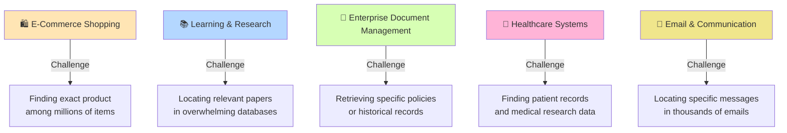

---

## 🔎 Search Platforms Comparison: Consumer vs. Enterprise

### Market Overview: Who Dominates What?

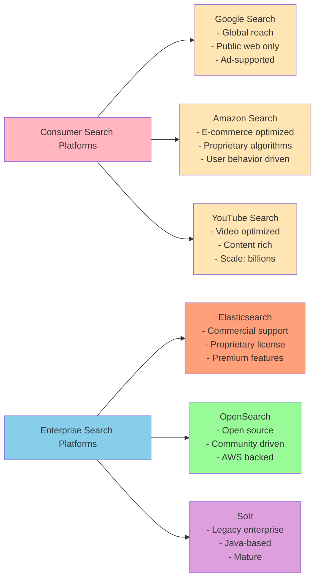

### Proprietary vs. Open Source: Detailed Comparison

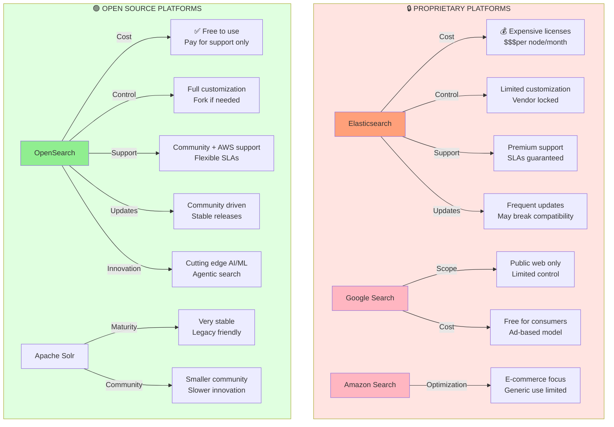

### Multi-Dimensional Comparison Matrix

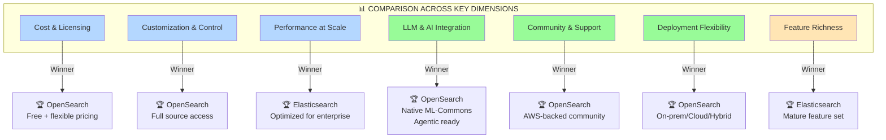

---

## 🌟 Why OpenSearch Excels: The Winning Platform

### OpenSearch Advantages Across Key Dimensions

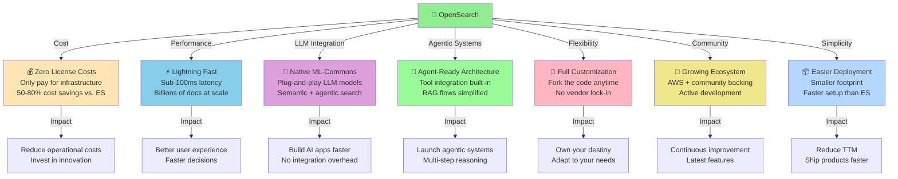

### Real-World Use Cases Where OpenSearch Shines

```mermaid
graph TB
    subgraph UseCase1["🛍️ E-Commerce"]
        UC1["Product Search<br/>Millions of SKUs<br/>Fast faceted search<br/>AI recommendations"]
        UC1 -->|OpenSearch Wins| W1["Lower costs per query<br/>Custom ranking<br/>Agentic recommendations"]
    end
    
    subgraph UseCase2["🏥 Healthcare"]
        UC2["Medical Records Search<br/>Patient data retrieval<br/>Research paper discovery<br/>Compliance critical"]
        UC2 -->|OpenSearch Wins| W2["No license tracking<br/>On-prem deployment<br/>Semantic search for outcomes"]
    end
    
    subgraph UseCase3["💼 Enterprise"]
        UC3["Document Management<br/>Compliance search<br/>Internal KMS<br/>Audit trails required"]
        UC3 -->|OpenSearch Wins| W3["Cost effective scaling<br/>Full audit control<br/>Custom security"]
    end
    
    subgraph UseCase4["📊 Analytics"]
        UC4["Log Search<br/>Time-series analysis<br/>Real-time insights<br/>At massive scale"]
        UC4 -->|OpenSearch Wins| W4["Lower cloud bills<br/>Better compression<br/>Custom aggregations"]
    end
    
    subgraph UseCase5["🤖 AI/ML"]
        UC5["Semantic Search<br/>RAG systems<br/>Agentic reasoning<br/>LLM grounding"]
        UC5 -->|OpenSearch Wins| W5["Native integration<br/>ML-Commons built-in<br/>Future-proof AI stack"]
    end
    
    style UseCase1 fill:#FFE5B4
    style UseCase2 fill:#FFB4D7
    style UseCase3 fill:#B4D7FF
    style UseCase4 fill:#98FB98
    style UseCase5 fill:#DDA0DD
```

### Cost Analysis: The Financial Case for OpenSearch

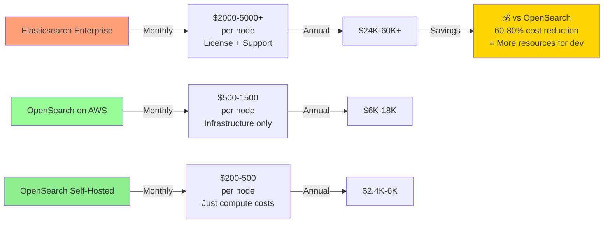

### Speed & Complexity: OpenSearch vs. Others

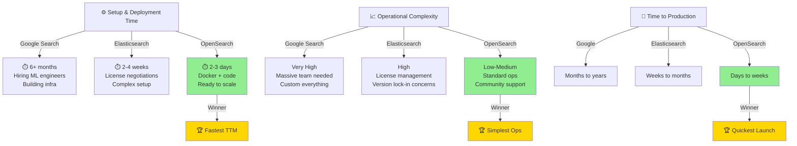

### Integration with LLM & Agentic Systems

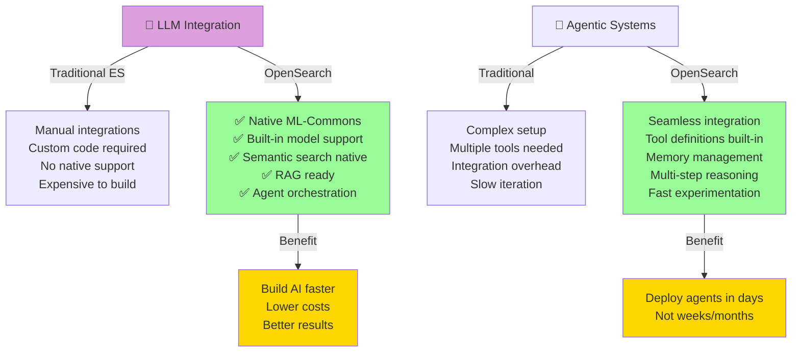

---

## 🎯 Complete Search Ecosystem Mindmap

### Keywords & Concepts in Modern Search

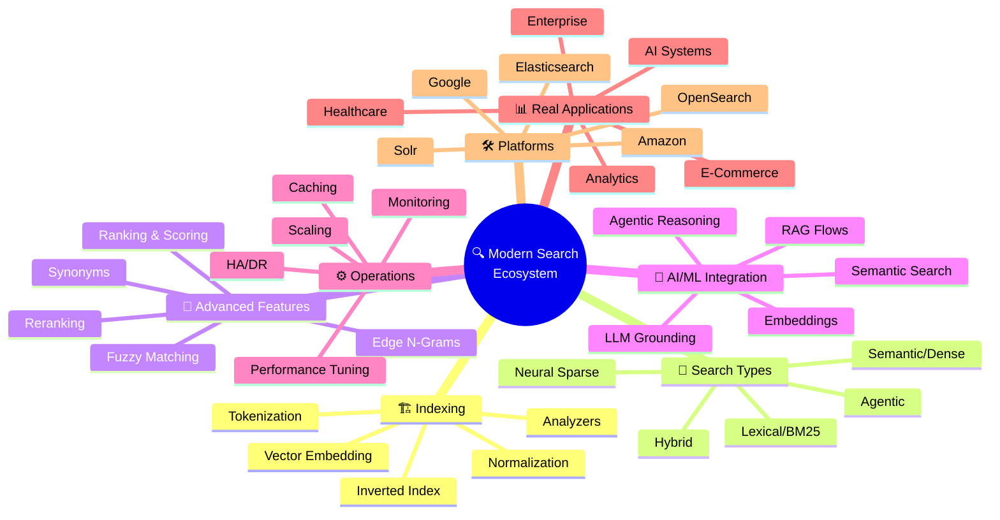

---

## ✨ Why Choose OpenSearch Today?

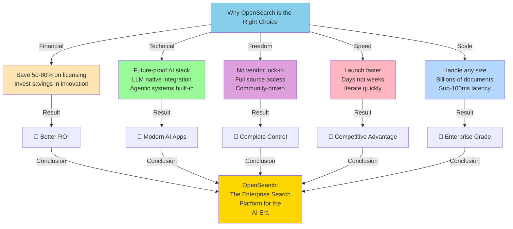

---

## 🚀 Get Started with OpenSearch

**Ready to transform your search experience?**

- 📖 Explore the [OpenSearch Documentation](https://opensearch.org/docs/)
- 🐳 Quick Start with [Docker Compose](../INSTALLATION_CONFIGURATION/)
- 💡 Learn Advanced Concepts in our [Full Course](../)
- 🤝 Join the [OpenSearch Community](https://opensearch.org/community)

**Build the future of enterprise search with OpenSearch today! 🌟**

